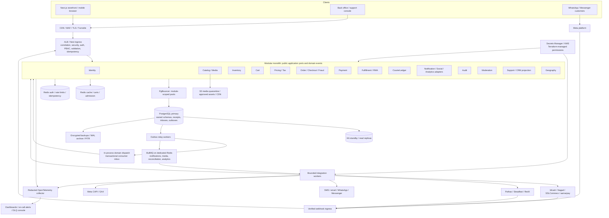
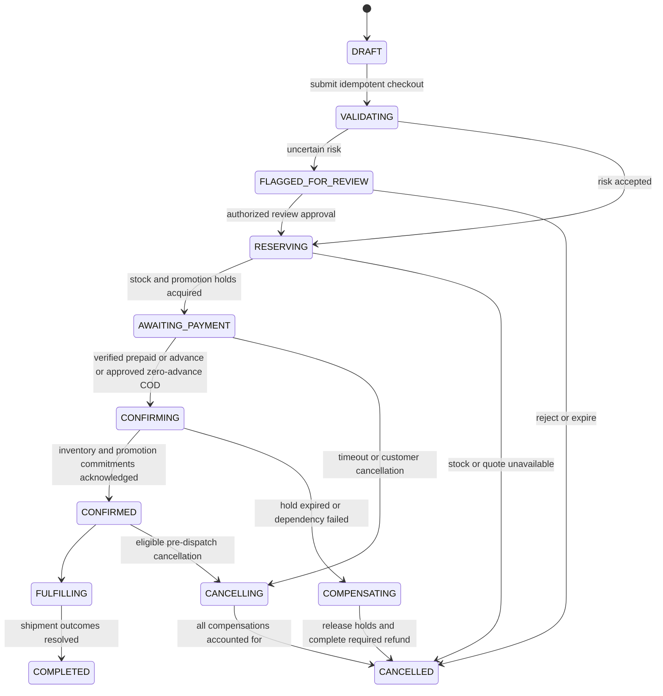
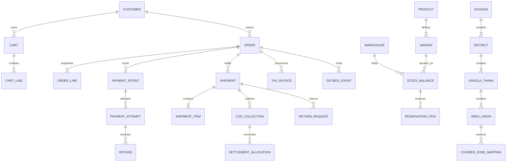

# Aaraj enterprise e-commerce architecture and implementation blueprint

Design baseline: 1 October 2026. Scope: Bangladesh launch, with later regional growth. This remains a target architecture, not a claim that every described domain or production control is implemented.

Read this document with the [complete data model and ERDs](ecommerce-data-model.md), [PostgreSQL DDL](ecommerce-schema.sql), and [phased roadmap and Day 1 execution checklist](ecommerce-implementation-roadmap.md). Together they form the four requested sections. The SQL is a design artifact for review and disposable-database validation, not a production migration to apply wholesale.

## Baseline, decisions, and boundaries

Repository inspection confirms `apps/api` uses NestJS `^12.0.1`, Node `>=24.15.0 <25`, `type: module`, TypeScript NodeNext, Vitest, and Oxlint. `apps/web` is **Next.js 16**, not an undecided Next/Vite application. `packages/contracts` exports Zod 4 contracts. The workspace pins pnpm `12.5.1`; the observed local runtime is Node `24.19.0`. Relative TypeScript imports must end in `.js`. All cross-package imports use package exports.

Current implementation status (4 October 2026): the monorepo has a local PostgreSQL/Redis stack; a Nest API with explicit runtime PostgreSQL TLS policy, Better Auth email/password, Redis-backed auth rate limiting, Nest PBAC, append-only audit storage/review, and a persisted product catalog. The catalog supports a managed category tree, with one active leaf category per product style. The Next.js storefront has public browse/detail pages and staff pages for product, category, and size-guide management. Nest remains the authorization boundary, and catalog writes are audited in their database transaction. Inventory, pricing, carts, checkout, orders, payments, a transactional outbox, and production infrastructure are not implemented. Treat the remaining architecture and full SQL as proposals; do not apply the full schema wholesale.

| Decision                   | Selected approach                                                                                                                  | Consequence                                                                                                                                         |
| -------------------------- | ---------------------------------------------------------------------------------------------------------------------------------- | --------------------------------------------------------------------------------------------------------------------------------------------------- |
| Application architecture   | DDD modular monolith, independently scalable HTTP and worker processes from the same API codebase                                  | Preserve module boundaries without premature network services                                                                                       |
| Data                       | PostgreSQL 16+; `pg` and Drizzle behind module-owned repositories; reviewed SQL migrations                                         | Explicit locks, constraints, partitions, and transaction handles remain visible                                                                     |
| Contracts                  | Zod / Standard Schema V1 in `@aaraj/contracts`                                                                                     | Transport models, events, enums, and validation have one public source; domain entities remain behavior-rich and private to their owner             |
| Concurrency                | PostgreSQL is authoritative; Redis accelerates admission and reads                                                                 | A lost Redis key cannot create money, stock, or a second business operation                                                                         |
| Events                     | Proposed module-owned PostgreSQL outbox/inbox when an asynchronous workflow is implemented                                         | No outbox or event relay exists in the current application                                                                                          |
| Jobs                       | `@nestjs/bullmq`, bounded worker pools, durable dispatch records                                                                   | Queue retries are expected; every business handler deduplicates                                                                                     |
| Providers                  | Typed HTTP adapters using Node 24 native `fetch`; `@nestjs/axios` only where specifically justified                                | No unmaintained bKash, Nagad, SSLCommerz, Pathao, Steadfast, or RedX wrappers                                                                       |
| Initial production hosting | AWS reference deployment: ECS/Fargate, ALB, RDS PostgreSQL Multi-AZ, managed Redis, S3/CloudFront, Secrets Manager, KMS, Terraform | Region, service availability, merchant data requirements, latency, and cost validated in Phase 0; equivalent infrastructure can replace these ports |
| Currency                   | BDT first; currency metadata and explicit rational FX quotes                                                                       | Amounts never silently mix currencies; no floating-point financial arithmetic                                                                       |
| Launch scope               | Single merchant and one fulfillment location; payment methods are a later product decision                                         | Multiple warehouses, marketplace sellers, escrow, and cross-border settlement are deferred until justified                                          |

`@nestjs/outbox` and native Standard Schema validation are documented by Nest. Their exact added package versions, ESM behavior, and Nest 12 peer compatibility still require a lockfile-backed check before installation. The blueprint does not replace that check with speculative package versions. See [Nest outbox](https://docs.nestjs.com/reliability/outbox) and [schema validation](https://docs.nestjs.com/application/validation).

Non-negotiable invariants:

- One context owns each table. Other modules use its public application interface or a versioned event; no cross-context SQL, foreign keys, ORM relations, shared repositories, or shared transaction handles.
- Every client mutation requires an `Idempotency-Key`; Redis keeps its replay response for **24 hours**, and durable owner-local receipts and provider references protect longer financial workflows.
- All prices, totals, taxes, discounts, advances, refunds, and ledger postings use integer subunits. BDT `1999` represents ৳19.99. Internal calculation uses `bigint`.
- No confirmed order without a valid price/tax snapshot, inventory commitment, completed risk decision, and required verified payment or COD approval.
- No fulfillment from a browser payment redirect; no refund beyond verified captured/collected and refundable amounts; no restock before disposition inspection.
- Logs, spans, error reports, queue diagnostics, and audit diffs use allowlisted, redacted data. OTPs, passwords, authorization headers, addresses, payment tokens, and raw webhook bodies never become telemetry.

## Section 1: Executive architecture topography



The diagram's database arrows are ownership routes, not permission to query every schema. A checkout request can synchronously call `Inventory.reserve()` through a port, but the Inventory implementation alone touches stock tables. Each module commits locally. An Order-owned process manager records the cross-module workflow, retries, and compensations. Read pages compose port results or use event-fed projections owned by the reader.

Deploy the HTTP process, outbox relays, and worker groups separately. Keep critical payment reconciliation separate from media, bulk email, and analytics queues. Autoscale by queue age and work duration as well as CPU; scale API replicas within the database connection budget. Start with one writer region and at least two availability zones. Stateless HTTP replicas never keep authoritative carts, sessions, stock, or checkout progress in memory.

### I. Core monolith architecture and ingress security

#### 01. Bounded contexts, layers, and public interfaces

| Owner         | Authoritative responsibilities                                                                        | Public application ports / events                                                         |
| ------------- | ----------------------------------------------------------------------------------------------------- | ----------------------------------------------------------------------------------------- |
| Identity      | Better Auth email/password accounts and sessions, permissions, staff MFA, consents                    | `authenticate`, `authorize`, `getCustomerEligibility`; `PermissionChanged`                |
| Catalog       | Products, variants, categories, brands, attributes, media metadata, searchable projections            | `getSellableVariants`; `ProductPublished`, `VariantChanged`                               |
| Inventory     | Warehouses, physical/reserved/available stock, reservations, movements                                | `reserve`, `commit`, `release`, `adjust`; `StockReserved`, `StockDeducted`                |
| Cart          | Guest/customer cart lifecycle, merge receipts                                                         | `merge`, `setQuantity`, `getCart`; `CartChanged`                                          |
| Pricing       | Price books, quotes, promotion rules/quotas, tax rules and invoice rendering rules                    | `quote`, `holdPromotion`, `consumePromotion`; `PriceChanged`, `PromotionConsumed`         |
| Order         | Commercial order aggregate, immutable line snapshots, checkout process, risk decisions, invoice facts | `place`, `confirm`, `cancel`, `approveRisk`; `OrderPlaced`, `OrderConfirmed`              |
| Payment       | Intents, attempts, captures, advance application, refunds, financial reconciliation                   | `createIntent`, `queryStatus`, `requestRefund`; `PaymentCaptured`, `RefundCompleted`      |
| Fulfillment   | Allocation plan, shipments, consignments, delivery evidence, returns and inspection                   | `plan`, `book`, `correctAddress`, `requestReturn`; `ShipmentDelivered`, `ReturnInspected` |
| CourierLedger | Courier receivables, fees, payouts, matched remittances, disputes                                     | `recordCollection`, `reconcileStatement`; `CourierSettlementMatched`                      |
| Notification  | Delivery intents, preferences, templates, social/provider adapters, consented analytics jobs          | `requestDelivery`; `NotificationDelivered`, `SocialMessageReceived`                       |
| Audit         | Append-only redacted security and business audit evidence                                             | `record`, privileged `query`; `AuditCheckpointSealed`                                     |
| Moderation    | Reviews, abuse reports, decisions, profanity/risk-assisted content screening                          | `submitReview`, `reviewDecision`; `ReviewPublished`                                       |
| Geography     | Versioned BD hierarchy and provider-zone mapping data                                                 | `validatePath`, `resolveCourierZone`; `GeographyVersionPublished`                         |
| Support       | Tickets, event-fed customer timeline, support access sessions                                         | `getTimeline`, delegated domain commands; `TicketOpened`                                  |

Geography and Support are explicit supporting contexts; neither becomes a shared-table shortcut. The fraud policy engine belongs to Order, while provider social and CAPI transports belong to Notification. Support owns conversations, human handoff, and social draft-order state; verified inbound messages and outbound delivery requests cross the Notification boundary through events/ports. Tax calculation belongs to Pricing; issued invoice snapshots belong to Order. CourierLedger is operational reconciliation, with an eventual accounting-system export port rather than an undeclared replacement for a general ledger.

```text
apps/api/src/modules/<context>/
  domain/           # entities, value objects, policies, state transitions; no Nest/ORM/HTTP
  application/      # commands, queries, process managers, ports, transaction orchestration
  infrastructure/   # Drizzle/pg repositories, own outbox store, typed provider clients
  ingress/          # Nest controllers, handlers, guards, response mapping
  public.ts         # narrow interfaces and injection tokens; relative imports end .js
  <context>.module.ts
packages/contracts/src/
  common/ identity/ catalog/ inventory/ cart/ pricing/ order/ payment/
  fulfillment/ geography/ notification/ audit/ moderation/ support/ courier-ledger/
```

Only stable schemas, public value types, and versioned event envelopes live in contracts; frontend bundles never import repositories, secrets, or ORM entities. A boundary check in CI rejects imports into another module's private directories and cross-schema SQL. Each repository requires its owner's transaction context; no global generic repository exposes arbitrary tables. Shared primitives can include a clock, IDs, integer arithmetic, and telemetry, but not shared mutable business services. Consider extracting a service only when measured scale, isolation, or team ownership justifies the added network failure modes.

#### 02. PostgreSQL, pooling, replicas, and partition lifecycle

Use a separate schema and database runtime role per owner, restricted `search_path`, qualified table names, no runtime DDL, and a separate migration role. Bound total connections: `API replicas × per-owner pool caps + worker pools + migrations + reserve <= DB connection budget`. With many modules, lazily open small pools and enforce a shared process-wide cap; PgBouncer does not remove server-side limits.

PgBouncer uses transaction pooling for normal queries. Avoid session-local state and session advisory locks; use transaction-scoped settings/locks. Prepared-statement support depends on the pool version and configuration, so exercise the chosen pg/Drizzle configuration in integration tests. Migration and replication connections bypass the transaction pool. [PgBouncer feature compatibility](https://www.pgbouncer.org/features.html).

Route payment status, stock availability at checkout, permissions, idempotency receipts, and read-after-write order responses to the primary. Replicas serve explicitly stale-tolerant catalog/admin reporting reads; return projection timestamps. If replica lag exceeds the configured threshold, use primary within its capacity or degrade reporting. No automatic retry of an uncertain write on another server.

Range-partition `ordering.orders`, `audit.audit_logs`, and each owner's `outbox_events` by immutable UTC creation time. Create upcoming partitions ahead of traffic; alert on missing partition coverage and unexpected default-partition growth. Composite PK/FK columns must include the partition key; a small unpartitioned ID registry prevents an order/event ID appearing in multiple time partitions. Time does not determine a payment's deduplication lifetime. Never prune pending outbox records or unresolved financial references. The companion DDL implements this structure. [PostgreSQL partition constraints](https://www.postgresql.org/docs/16/ddl-partitioning.html).

Use keyset pagination with stable composite cursors, indexes driven by query plans, bounded statement/lock timeouts, autovacuum monitoring, and optimistic aggregate versions. Monthly partitions are the starting policy for orders/audit; adjust outbox interval after measuring volume. Archive and detach according to retention and legal hold policy, with a tested lookup path for historical orders.

#### 03. Permission-based authorization

Authorize a named capability against the operation and, when relevant, the resource. Use NestJS's official policy-based authorization module. Roles are permission bundles, not endpoint checks, and do not imply a hierarchy.

The implemented base roles are `superadmin`, `admin`, `staff`, `moderator`, and `customer`. Current grants cover access management, superadmin-only audit review, and catalog management for staff/admin/superadmin. There is no wildcard bypass. Each protected operation is authorized either by a handler-level `@Can()` check or by `AuthorizationService.authorize()` in its owning service. Record- and transaction-dependent checks belong in the service; both layers are used only when they enforce distinct rules. Authorization for sensitive writes is evaluated in the write transaction when consistency with mutable access state is required. There is no warehouse/location scope in the launch authorization model.

Permission keys name concrete actions introduced with their routes and use cases. The implemented PBAC base provides `access.read_self`, `access.read`, `access.manage`, `audit.read`, and `catalog.manage`, persisted elevated role assignments, protected `/api/access/*` endpoints, a superadmin-only `/api/audit/events` review route, and an operator-only first-superadmin bootstrap. Role grants and revocations are reauthorized and committed with their audit event in the same database transaction. Concurrent changes preserve the last superadmin. Role writes require a trusted Origin and a sign-in within 15 minutes. The exact base matrix and setup instructions are in [the authorization guide](../backend/security/02-authorization.md). Commerce capabilities are added with their feature workflows.

Customer sign-up and sign-in remain email/password without OTP or phone verification. Role changes require a recent email/password sign-in; other sensitive staff workflows define their own step-up requirements when implemented.

#### 04. Validation, security headers, and the request lifecycle

Ingress order is: edge limits → bounded raw-body capture where required → request/correlation context → CORS/Helmet/body-size controls → authentication/CSRF → permission and rate-limit guards → idempotency header checks → Standard Schema parameter validation → application use case with durable idempotency → response allowlisting/redaction. Nest interceptors wrap pipes, so compute the canonical request fingerprint in the validated command layer; do not assume a pre-handler interceptor sees parsed DTO output.

Register the built-in `StandardSchemaValidationPipe` globally and attach a schema to **each** body/query/path/custom parameter. A global pipe does not infer schemas from TypeScript types. Use the actual Nest 12 syntax:

```ts
// Illustrative addition to a module; create the referenced contract/use case first.
import { Body, Controller, Post } from "@nestjs/common";
import { PlaceOrderSchema, type PlaceOrderInput } from "@aaraj/contracts";
import { PlaceOrderUseCase } from "../application/place-order.use-case.js";

@Controller("orders")
export class OrdersController {
  constructor(private readonly placeOrder: PlaceOrderUseCase) {}

  @Post()
  place(@Body({ schema: PlaceOrderSchema }) command: PlaceOrderInput) {
    return this.placeOrder.execute(command); // actor/idempotency supplied by request context
  }
}
```

Use strict object schemas, bounded strings/arrays/nesting, explicit numeric parsing, reserved-key rejection, parameterized SQL, response schemas, and allowlisted sort/filter keys. Never merge untrusted objects into configuration/prototypes. Validate provider responses as carefully as client payloads. Configure Helmet CSP/HSTS/frame protections on the appropriate API/storefront surfaces, with explicit Turnstile/payment-origin allowances. CORS uses exact production origins, no wildcard with credentials, and allows `Idempotency-Key`; same-site secure HttpOnly sessions also require CSRF defenses. Restrict trusted proxies to actual ingress hops and validate forwarded addresses.

#### 05. Distributed rate limiting and abuse budgets

Use `@nestjs/throttler` with a reviewed Redis-backed `ThrottlerStorage` implementation, atomically counting across replicas. Configure route tiers explicitly so authentication's stricter policy does not accidentally apply to every browsing endpoint. Start with **120 requests/minute for public browsing, 5/minute for authentication, and 10/minute for checkout/payments**; tune by load/abuse evidence. The library's TTL units are milliseconds. [Nest rate limiting](https://docs.nestjs.com/security/rate-limiting).

Combine IP/subnet, actor/session, normalized identifier HMAC, device, and endpoint budgets rather than trusting a spoofable header. Use the same generic sign-in failure for unknown identifiers and wrong passwords. Carrier NAT users need bounded burst tolerance and observable false-positive rates. Return `429` and `Retry-After`; authentication and payment mutations fail closed when distributed abuse controls are unavailable, while public cached browsing may use an emergency edge limit. Verified provider webhooks get separate signature-aware capacity budgets so customer limits do not block reconciliation.

#### 06. Secrets and infrastructure as code

Select AWS Secrets Manager/KMS for the reference deployment; use Vault if operational requirements justify its management burden. Fetch secrets through task identity, not committed `.env` files or baked images. Rotate database/provider credentials with overlap and test reconnect behavior. Never expose private API values through Next.js `NEXT_PUBLIC_*`, build logs, Terraform outputs, or remote-state readers. Store state encrypted with locking and narrowly scoped access.

Terraform modules cover network/private subnets, security groups, ECS services, ingress, RDS/replicas, PgBouncer, Redis, object storage/CDN, secrets/IAM/KMS, telemetry, alerts, backups, and DNS. Isolate staging and production accounts/state. CI uses OIDC identities and immutable image digests. Run non-root containers with a read-only filesystem, bounded memory/CPU, graceful shutdown, health probes, and restricted outbound provider access. Pin reviewed image/tool versions; scan dependencies and images and record an SBOM. Local Compose is a development convenience, not production HA.

### II. Catalog, search, media, and stock

#### 07. Inventory and flash-sale concurrency

Track sellable `physical_stock`, `reserved_stock`, and generated `available_stock = physical_stock - reserved_stock` per warehouse/variant. Damaged/quarantined returns are separate dispositions and do not inflate sellable physical stock. Enforce nonnegative values and `reserved <= physical` in PostgreSQL.

Reservation algorithm:

1. Validate quantity/quote/cart ownership and use a stable reservation command ID. A Redis Lua script may atomically admit a flash-sale attempt against a conservative availability mirror, with a token/lease and bounded queue. This is admission control, not a completed reservation.
2. Inventory starts its own DB transaction, checks the durable receipt, locks all required stock rows using `SELECT ... FOR UPDATE` in sorted `(warehouse_id, variant_id)` order, then verifies availability. Reject or re-plan before any payment call if stock is insufficient.
3. Update reserved quantities, insert the reservation and items with expiry/version, append movements/outbox/receipt, and commit atomically. Only this commit makes the reservation authoritative. Update/rebuild Redis from committed events.
4. On release/expiry, lock the reservation and stock rows; transition once and decrement reserved once. On dispatch/stock deduction, decrement physical and reserved together once. A sweeper handles expirations even if Redis TTL notifications never arrive.
5. On an uncertain timeout, query the durable receipt before retrying. Reconcile orphan admission tokens from PostgreSQL. A stale Redis mirror may reject excess demand but can never authorize overselling.

All keys used by a multi-key Lua operation must share a Redis Cluster slot; avoid cross-warehouse atomic Lua assumptions. PostgreSQL lock ordering resolves multi-item atomicity. Reserve for a policy-defined checkout window (initially 10 minutes); risk review uses a separately bounded hold. Payment success after expiry triggers re-reservation or a controlled refund, never stock fabrication. Prove this with many concurrent buyers for one remaining unit and Redis restart fault injection.

#### 08. Search, faceting, and read projections

Start with `pg_trgm` indexes and a maintained Catalog-owned search document; use Unicode normalization, Bangla/English names and aliases, SKU exact matches, and explicit ranking. Use `simple` tokenization or a validated language analyzer for Bangla; do not assume an English stemmer handles it. GIN JSONB indexes support product attributes, with targeted expression indexes for hot filters. Facets include category, brand, typed attributes, quoted price ranges, and a timestamped in-stock projection.

Catalog consumes Inventory/Pricing events into its own search projection, without joining those schemas. Event version checks prevent stale updates; reindex through owner export APIs and a generation swap. Zero results return spelling suggestions, relaxed filters visibly labeled, or popular category items. Never silently alter a checkout SKU. Search results are advisory; live quote and reservation revalidate price and stock.

An adapter can move indexing to Meilisearch or Elasticsearch once corpus size, ranking quality, or latency warrants it. Track zero-result rate, Bangla query quality, index lag, and conversion by query; pin the selected engine version only after evaluation.

#### 09. Pricing, bundles, flash sales, and cache stampedes

Pricing owns effective-dated price books, quantity tiers, bundle rules, schedules, eligibility, caps, and immutable rule versions. Use database/server time in UTC with `Asia/Dhaka` display, never browser time. Quotes contain line prices, promotion/tax versions, fulfillment assumptions, currency, total, and expiry. Once paid/confirmed, later price edits do not change order snapshots.

Evaluate candidate rules deterministically by explicit priority and combinability group. A bundle allocates its savings back to physical SKU lines for returns. Serialize global/per-customer promotion holds before confirmation, with release/expiry compensation. Flash-sale traffic enters a bounded queue rather than exhausting DB pools.

Use per-key singleflight leases with a unique owner token, bounded wait, token-checked release, TTL jitter, and stale-while-revalidate for public product data. A losing or expired lock holder cannot delete a successor's lock. Cache invalidation follows committed versioned events; stale catalogs never determine payable totals.

#### 10. Media processing and CDN delivery

Issue short-lived upload URLs to a quarantine bucket after permission, size, type, and quota checks. Validate actual decoded file type, pixel count, compression expansion, and malware; strip EXIF/location data. Sandboxed workers generate deterministic WebP/AVIF/JPEG variants, responsive widths, and placeholders from an immutable content hash. Publish only approved assets and retain original-to-derivative provenance.

Use immutable CDN URLs and long `Cache-Control` lifetimes for content-hashed assets. Mutable product pages use short cache TTLs plus the selected CDN's surrogate-key/cache-tag invalidation API; cache tags are not a universal HTTP feature. Restrict image fetching to approved origins to prevent SSRF. Generate OpenGraph cards from trusted product snapshots, without addresses/order tokens. The storefront includes dimensions, alt text, responsive `srcset`, keyboard accessibility, and a low-bandwidth mobile path.

### III. Cart, financial math, and promotions

#### 11. Hybrid carts and identity merge

Anonymous carts use a high-entropy opaque ID in a signed, secure HttpOnly cookie, with rotating signing keys. Redis stores the cart for a **7-day TTL**; signing proves cookie integrity, not identity. Persist authenticated carts in the Cart schema. Never store prices supplied by the browser as authority.

On login, lock/version the destination cart and record a unique guest-cart merge receipt in one Cart transaction. Coalesce equal variant/options lines, apply quantity caps, preserve explicit user choices, and consume the guest cart only after commit. Repeating login cannot double quantities. Re-quote through Pricing and fetch availability through Inventory; show changed prices and unavailable items with explicit customer confirmation. Customer cart durability survives Redis loss; lost guest carts are a disclosed cache durability tradeoff, with persistent Redis/recovery configured to reduce loss.

#### 12. Integer money, rounding, and FX

Database money is `bigint`; calculations use TypeScript `bigint` from boundary to result. When pricing is implemented, define a public money contract such as `{ amount: 1999, currency: "BDT" }` with integer/safe-range validation and an explicit supported-currency policy. Choose a documented per-operation cap below `Number.MAX_SAFE_INTEGER`, and reject larger public values rather than truncate. Convert to `number` only after a checked bound. Ledger exports that exceed the public cap use explicitly versioned decimal-integer strings. The current catalog has no price or money contract; add and test one with the pricing workflow rather than relying on a generic starter schema.

Parse gateway decimal amounts from strings by splitting whole/fraction digits and padding to the currency exponent. Never use `parseFloat`, `Math.round(amount * 100)`, or divide by `100` to perform financial math. Render the integer quotient/remainder or use a formatting library proven not to round-trip through floating point. Reject excess fractional digits unless an explicit provider rounding policy exists.

For positive values, a documented half-up rational rounding rule can use `(numerator + denominator / 2n) / denominator` with positive denominator; signed reversals reuse the original rounded allocation rather than recompute. Taxes may require a different legally validated rule, stored as a version. Percentages use integer basis points or an exact `(numerator, denominator)` pair. Inclusive tax extraction is `round(gross × rateNumerator / (rateDenominator + rateNumerator))`; exclusive tax is `round(net × rateNumerator / rateDenominator)`. All intermediate products are bigint.

Normalize persisted order line bases to tax-exclusive subunits, even when customer display prices include tax. Store the original display basis and extraction rule in the tax snapshot; never add extracted tax to an already inclusive subtotal a second time. Header totals must agree with line, shipping, duty, and tax allocations under one documented equation.

FX records source/target currency exponents, rational rate, provenance, quote time/expiry, and rounding policy. Convert `sourceMinor × rateNumerator × 10^targetExponent / (rateDenominator × 10^sourceExponent)` once at the defined boundary. No implicit conversion in an order or ledger journal; a refund uses original currency and captured amount, with any cross-currency settlement recorded separately.

#### 13. Coupons, quota holds, and fair refund allocation

Rule inputs include SKU/category eligibility, customer segment, first-order policy, time window, minimum eligible spend, maximum discount, usage limits, and anti-stacking groups. Reject codes with uniform error messaging and rate limits; do not leak customer eligibility. Hold quota atomically in Pricing, then consume or release using the checkout operation ID. Unique customer/redemption references and locked counters defeat concurrent quota overspend.

Allocate an order discount across eligible lines using largest remainders: floor each `discount × eligibleLineBase / totalEligibleBase`, then distribute remaining subunits by descending fractional remainder with stable line-ID tie-breaking. Respect each line's maximum discount and repeat on remaining eligible capacity. For bases `1999, 1000, 1000` and discount `500`, allocations are `250, 125, 125`; net amounts are `1749, 875, 875` and sum to `3499`. Zero eligible base is rejected or yields no discount, never division by zero.

Persist line and per-unit allocations, including tax and shipping allocation policies, at checkout. A partial refund references remaining original allocations so sequential returns sum exactly to the original paid/refundable amount. Define whether a returned item invalidates a bundle at sale time and show the policy before purchase; never retroactively invent a clawback. Test penny/poisha remainders, overlapping coupons, all-free carts, concurrent redemptions, split shipments, and repeated partial refunds.

### IV. Bangladesh and South Asian localization

#### 14. Email/password identity

Use Better Auth's email/password system through the NestJS integration. At launch, neither sign-up nor ordinary sign-in requires email verification or OTP. Better Auth owns password hashing, account records, and sessions; keep commerce authorization and customer profile data in their owning modules. Apply bounded input, generic credential errors, and distributed rate limits. Email recovery may prove email ownership as part of the reset flow. Staff MFA and privileged step-up controls remain separate authorization safeguards and are not customer sign-up gates.

Serve the browser session through Better Auth's HttpOnly, SameSite=Lax cookies; production uses HTTPS so session cookies are secure. Keep trusted origins, CORS, and CSRF protections aligned. Use Better Auth's session lifecycle rather than a parallel custom refresh-token implementation.

#### 15. COD risk and partial courier-fee advances

Risk combines verified delivery history, RTS numerator/denominator, recency, order value, failed sign-in velocity where relevant, and review outcomes. Separate customer-caused refusal from courier failures or damaged goods; small samples need smoothing and a neutral default. Explain outcomes using reason codes and give staff/customer review paths.

For configured first-time/high-risk cohorts, require a disclosed **৳100–৳150 advance** (`10000–15000` paisa), capped at the order payable amount and captured through a verified MFS intent with purpose `COD_ADVANCE`. Persist policy version, disclosure, amount, and allocation. It is part of the order payment, not an additional charge: `remainingCOD = orderPayable - appliedVerifiedAdvance`. Never collect the full original total again at the door.

Advance required → payment pending → verified advance → reservation/risk recheck → order confirmed. If payment is unknown, keep it pending and reconcile. If the order cannot proceed, route the advance through the refund policy and verified refund workflow. Rejected/returned parcels and courier fees require explicit customer policy and legal review; the system must not assume advances are automatically forfeited. Store the advance separately from courier remittances to avoid duplicate revenue and payout matching.

#### 16. Typed local payment adapters and dual reconciliation

Define `PaymentGatewayPort` with `createAttempt`, `executeIfRequired`, `queryAttempt`, `requestRefund`, `queryRefund`, and provider-specific webhook verification. Return normalized results (`PENDING`, `SUCCEEDED`, `FAILED`, `UNKNOWN`) plus redacted provider reference and supported capabilities. Each adapter owns strict request/response schemas, credential refresh, timeouts, retries, sandbox fixtures, and API-version/merchant-contract metadata.

Use hosted payment pages/official MFS authorization flows; Aaraj never asks for an MFS PIN or customer OTP. Send decimal major-unit **strings** only when required by the provider, derived from integer subunits. Generate stable merchant attempt references before outbound calls. A new network retry does not create a new payment attempt or switch gateways while the first may have succeeded.

Verify webhook signatures over the required raw bytes where supported, and use provider status/validation APIs when that is the authentication mechanism. Check merchant identity, reference, currency, amount, transaction status, and replay uniqueness. Persist a minimally necessary encrypted inbox payload before acknowledging; process asynchronously. An IP allowlist is defense in depth, not proof of payment. A browser success/cancel/fail URL only triggers a status refresh.

Reconcile twice: (1) frequent queries for pending/unknown attempts and refunds with bounded backoff and age escalation; (2) daily settlement/transaction-report matching against captures, reversals, refunds, fees, and bank credits. A delivered COD return can only be refunded up to the independently verified courier collection allocation; use the approved customer payout rail even if it differs from the collection path. Provider success after a local timeout is captured once; duplicate or reordered notifications cannot reverse a terminal financial fact. Version provider APIs behind the port; production access and merchant-specific signing/refund documentation are launch gates. See the [provider verification register](ecommerce-provider-register.md).

#### 17. BD addresses and courier-zone mappings

Model `Division → District → Thana/Upazila → Area/Union` with stable internal IDs, Bangla/English names, administrative type, source version, effective dates, aliases, and replacement links. Preserve city/city-corporation distinctions where official data requires them. Validate the whole ancestry through Geography, not four unrelated IDs.

Store encrypted delivery detail/landmark and an immutable hierarchy/name snapshot on the order and shipment. Do not require a Western postal code; postal code can remain optional local metadata. Courier `city/zone/area` identifiers form a separate, effective-dated mapping keyed by provider/service. The internal four levels and provider zones are **not universally one-to-one**: many internal localities can map to one provider zone, and a locality may require service-specific resolution. Block booking when mapping is ambiguous/unserviceable; use reviewed overrides, never an arbitrary default Dhaka zone.

Version provider geography syncs, cache them, and revalidate at quote/booking. Address corrections before dispatch use optimistic versioning and the Fulfillment public port; after booking, require a provider-supported amendment or cancellation/rebooking workflow and new shipping/risk quote when necessary.

#### 18. VAT and Mushak 6.3 invoice lifecycle

Build a configurable tax engine, not a hard-coded universal VAT percentage. Effective-dated rules identify product/service classification, merchant registration/BIN, applicable rate/exemption, inclusive/exclusive basis, location/time, supplementary duty where applicable, and rounding. Freeze tax decisions in the order/invoice; retain source references and approvals for each rule version.

Create a Mushak 6.3 invoice from the current official form specification: seller/branch identity and BIN, invoice number/date, required buyer identifiers, item descriptions/classification where prescribed, unit/quantity/unit value, taxable values, duties/VAT, and totals. Preserve serial issuance and cancellation/adjustment evidence; render Bangla fonts correctly and retain signed-off PDF plus structured export. Link credit/debit adjustments and returns to the original invoice instead of editing issued tax history.

Generate/issue invoices at the legally applicable supply/tax point, including the approved treatment of COD advances and split deliveries. Finance must validate the current official form, classifications, invoice numbering, retention, and advance/refund treatment with NBR rules before enabling issuance. Persist VAT and supplementary duty separately when applicable; a credit/debit note references the original invoice and is immutable. The SQL supplies invoice snapshots and export records; those structures alone are not a compliance certificate. Official NBR sources and known verification limits are recorded in the [provider register](ecommerce-provider-register.md).

#### 19. Conversational commerce and channel identity

Receive signed WhatsApp/Messenger webhooks through a durable inbox, deduplicate provider message IDs, and normalize events into versioned contracts. A channel sender identifier does not by itself authorize linking to a customer account. Link accounts with explicit verification and consent, keeping channel credentials and messages encrypted/minimized.

Conversation agents and staff create **draft carts/orders through the same Cart/Order ports** as the storefront. Send a clear item/price/address/COD summary and record customer confirmation before placement. Apply identical stock, fraud, identity, idempotency, and payment rules. Human takeover stops automated replies; no language model or webhook can directly write an order table.

Keep template approvals, opt-in evidence, allowed conversation-window rules, unsubscribe state, and delivery receipts per channel. Send shipping updates from fulfillment events and customer-safe tracking links. Use provider policy/version checks at implementation rather than embedding a permanently assumed messaging window or fee schedule. CAPI marketing consent is separate from consent for necessary order notifications.

### V. Checkout, fulfillment, and financial reconciliation

#### 20. Durable outbox, inbox, universal idempotency, and checkout

Every context writes domain state, its outbox event, and its command receipt in **one local transaction**. The relay claims committed events using short `FOR UPDATE SKIP LOCKED` transactions and leases; the network dispatch happens outside the lock. Confirm publication only after dispatch acknowledgment, with token/fencing checks to prevent an expired worker acknowledging another claim. A crash after dispatch but before acknowledgment causes a duplicate, which consumers must tolerate.

Use event envelopes `{ eventId, eventType, schemaVersion, aggregateId, aggregateVersion, occurredAt, correlationId, causationId, payload }`. A consumer inserts `(consumerName, eventId)` and applies its state change in the same transaction. Ordering is per aggregate, not global: aggregate version gaps are parked/retried and reported; identity/sequence allocation alone does not establish commit order. Do not mark inbox completion before the state mutation. Durable external-command rows bridge a consumer transaction to a provider call.

Dispatch local handlers through `@nestjs/event-emitter`/CQRS behind the durable dispatcher. For BullMQ, use a stable dispatch/job ID and keep owner-side completion evidence. Redis enqueue acknowledgment is not permanent proof that the job survived Redis recovery; retain outbox/dispatch records long enough to reconcile and re-enqueue incomplete work after loss. These rules provide at-least-once delivery with deduplicated local effects, not a promise of globally exactly-once external delivery.

Idempotency protocol:

| Stage        | Required behavior                                                                                                                                                                                                               |
| ------------ | ------------------------------------------------------------------------------------------------------------------------------------------------------------------------------------------------------------------------------- |
| Admission    | Require a bounded opaque key on POST/PUT/PATCH/DELETE, including administrative and auth mutations; reject missing/invalid keys before side effects                                                                             |
| Scope        | Derive owner, authenticated actor/session, HTTP operation/version, and key; never share results between users                                                                                                                   |
| Fingerprint  | Canonicalize the validated semantic command and hash/HMAC it; omit ephemeral Turnstile/proof tokens from business fingerprint while verifying proofs before execution                                                           |
| Claim        | Atomically acquire Redis pending lease, then insert/check owner-local durable receipt using a unique scoped key in the business transaction                                                                                     |
| Replay       | Same key and same payload returns the original status/body or stable operation reference; different payload returns `409 IDEMPOTENCY_CONFLICT`; pending work returns `202` with operation URL or `409 IN_PROGRESS` consistently |
| Persistence  | Commit result/reference alongside state and outbox; serialize only allowlisted responses; Redis replay TTL is `86400` seconds                                                                                                   |
| Failure      | Never save an uncertain provider outcome as a definitive failure; recover via durable attempt/reference and status query                                                                                                        |
| Cache outage | Check durable receipts and use the DB fallback only when configured abuse controls remain safe; otherwise `503` before mutation, never unrestricted execution                                                                   |
| Retention    | Durable order/payment/refund/stock uniqueness and receipt policy outlive the 24-hour cache; key expiry never authorizes charging the same business intent twice                                                                 |

Webhooks cannot be forced to send Aaraj's header: derive an internal idempotency key from verified provider event/transaction identity. Jobs and scheduled commands similarly use stable event/job/business IDs. Even a new client key cannot bypass order/capture/refund natural business uniqueness. Endpoints with secure one-time secrets return operation/session references or encrypted scoped replay responses; cache entries must not expose tokens or other customers' PII.

Checkout is a persisted Order process manager, not a transaction spanning five schemas. The diagram shows checkout_sagas.state, not orders.state: DRAFT maps to an order draft/CHECKOUT_PENDING, AWAITING_PAYMENT maps to the matching order state, and COMPENSATING is a saga step while the order remains pending cancellation. Keep saga and customer-facing order states as separate versioned state machines:



Keep payment, shipment, return, and risk statuses as separate state machines; `REFUNDED` is not a complete representation of an order with one returned item and another delivered. Persist each workflow step, command ID, expected version, deadline, next retry, and compensation. Acquire inventory/promotion holds before collecting money; confirm only after required receipts. Expiry workers race through guarded transitions, not unchecked timestamp updates. A late capture in `CANCELLED` triggers a refund/review workflow. Compensation itself can fail and must remain visible until reconciled.

#### 21. Multi-warehouse allocation and split shipments

Rank warehouse candidates by serviceability, stock, delivery promise, cost, capacity, and split penalty. Start deterministically: fulfill from one eligible warehouse if possible; otherwise choose a bounded split and obtain customer agreement if price/promise changes. Inventory reserves all selected lines atomically inside Inventory; Fulfillment records the plan separately via the saga.

Keep a single customer order with fulfillment groups/sub-orders and independently tracked shipments. Split quantities, discounts, taxes, shipping charges, prepaid coverage, and COD receivables explicitly; allocations sum to original order values. Each consignment has its own tracking number and one merchant reference. A single delivered parcel does not mark the parent order fully delivered. Backorders require an explicit policy, a separate promise, and customer consent; they are not an automatic escape from stock constraints.

#### 22. Courier adapters, labels, and webhook fallback

`CourierPort` exposes capability discovery, serviceability/zone resolution, quote, create/query/cancel consignment, label retrieval, and status normalization. Implement Pathao, Steadfast, and RedX with typed `fetch` clients, schema validation, bounded timeouts, and per-provider bulkheads. Store raw provider status codes alongside normalized events for diagnosis, without leaking addresses into logs.

Before booking, persist a stable merchant consignment reference and encrypted immutable recipient/amount snapshot. When a booking request times out, query by merchant reference before retrying; if the provider cannot deduplicate or query reliably, flag for manual reconciliation rather than create a duplicate pickup. Booking failures do not send false tracking messages.

Verify courier webhooks using the available provider mechanism, deduplicate event identity, and poll overdue in-transit consignments with jittered schedules, page/rate limits, and a status-age SLA. Distinguish event time from receive time, and enforce valid transitions so delayed `IN_TRANSIT` cannot undo `DELIVERED`. Require delivery/collection evidence before ledger recognition. Generate reviewed 4×6-inch thermal labels with supported Bangla fonts, barcode/tracking reference, minimum necessary PII, and controlled reprint audit. Tracking endpoints require secure ownership or unguessable expiring tokens.

#### 23. Courier COD reconciliation and balanced journals

Treat the courier as a debtor after verified COD collection. Store effective-dated merchant fee contracts and the fee/commission/tax base snapshot per consignment. **1% is a configurable example, not a universal courier rule**. Match statement lines to consignment and payout references, supporting one payout covering many orders and partial/adjusted settlements. Validate currency, amount, duplicate statement hashes, bank reference, and payout date. Unmatched or conflicting lines enter a discrepancy case; never auto-write off a mismatch.

Example in paisa, excluding fee VAT/other deductions for clarity: order payable `250000`, verified advance `15000`, courier collection `235000`, delivery fee `10000`, and hypothetical commission `2350` yield expected remittance `222650`. The commission is calculated on the contract-defined base; another contract may use a different base/rate.

At collection, post Dr courier receivable `235000`, Cr customer collection clearing `235000`. At matched settlement, post Dr bank `222650`, Dr delivery expense `10000`, Dr COD commission expense `2350`, Cr courier receivable `235000`. Add separate fee VAT/withholding/adjustment lines as applicable. Advance accounting remains in Payment and is not courier cash. Journals balance per currency; reversal journals correct mistakes instead of editing posted lines.

Enforce journal totals and immutability in a transaction/DB posting function or deferred constraint trigger; a row `CHECK` cannot validate an aggregate across postings. Lock account/settlement invariants as needed. Report aged receivables, payout lag, collection variance, duplicate deductions, RTS fees, and disputed remittances. Export to the finance system with a stable journal reference.

#### 24. Returns, doorstep rejection, inspection, and refunds

RMA states: `REQUESTED → AUTHORIZED/REJECTED → PICKUP_PENDING → IN_TRANSIT → RECEIVED → INSPECTED → REFUND_PENDING → CLOSED`; branch to replacement/dispute where policy permits. A doorstep rejection creates an RTS flow with courier evidence; it does not instantly put stock back on sale or prove that money was never collected.

Validate eligible quantity against delivered/rejected units and prior open/closed RMAs. Record reasons, evidence, original line allocations, policy version, pickup cost, inspection grade, and final disposition (`SELLABLE`, `QUARANTINE`, `DAMAGED`, `WRITE_OFF`). Inventory receives an idempotent adjustment only after approved inspection. Fulfillment cannot directly update stock.

Payment locks refundable capture allocations and reserves refund amounts before provider submission. Partial/multi-attempt refunds cannot exceed remaining captured or verified COD-collected value. Prefer original payment instrument where supported; any wallet credit is an explicit customer choice with a properly balanced stored-value liability and jurisdiction review. COD refund destinations require verified account ownership/confirmation and recent authorization, not an arbitrary support-entered number. Apply restocking/shipping deductions only under disclosed, approved policy and preserve credit-note/tax adjustments. Failed or unknown refunds stay open for reconciliation and customer visibility.

#### 25. Notifications and reliable delivery

Business events create immutable notification intents with recipient reference, template version, locale, purpose, consent basis, and deduplication key. Worker-time resolution retrieves only necessary PII through authorized ports. Separate transactional SMS/WhatsApp/email from marketing; honor opt-outs where applicable without suppressing necessary operational notices improperly.

Use `@nestjs/bullmq`, bounded concurrency per provider, exponential backoff with jitter, retry ceilings, and explicit permanent/transient error classification. Delivery status is `PENDING/SENT/DELIVERED/FAILED/UNKNOWN`, since a provider accepting a request does not guarantee delivery. Query ambiguous sends where supported. Provider receipts update durable delivery attempts; automatic fallback channels respect preferences and deduplication to avoid a message storm. Exhausted jobs create a durable DLQ record and alert, not just a console log. [BullMQ retry behavior](https://docs.bullmq.io/guide/retrying-failing-jobs).

### VI. Fraud, audit, administration, and support

#### 26. Explainable risk and review quarantine

Start with versioned deterministic rules and analyst review before training a model on sufficient labeled outcomes. Evaluate IP/account velocity, repeated failed deliveries, basket anomalies, device signals with appropriate consent, address consistency, suspicious discount use, and payment-attempt behavior. Avoid claiming a phone is disposable based only on a mobile prefix.

Store score, rule version, bounded evidence references, confidence, reason codes, decision, reviewer, and override expiry. `FLAGGED_FOR_REVIEW` pauses confirmation/booking; choose a bounded stock hold or release/re-reserve policy visibly. Review SLA violations escalate rather than silently discard the order. Measure false positives, segment bias, analyst agreement, charge/refusal rates, and customer appeals. Restrict fingerprint retention and raw-IP access; pseudonymous identifiers remain sensitive data.

#### 27. Append-only, tamper-evident audit

Every administrative mutation writes a redacted audit fact into its owning transaction/outbox, including actor, delegated actor, action, resource, request/correlation ID, timestamp, reason, approval reference, and allowlisted before/after differences. Audit later receives it through an inbox; this avoids a cross-schema audit dual write. If the owner cannot durably record the audit fact, sensitive mutation fails.

Audit runtime roles may insert but cannot update/delete; read access is separate and scoped. Chain records/checkpoints with cryptographic hashes and publish signed periodic roots and encrypted exports to independently controlled object storage with retention lock. Verify chain continuity and missing source sequences in scheduled jobs. A database superuser can alter a database table, so “tamper-proof” requires independent evidence and access separation; the honest guarantee is append-only application access plus tamper detection.

Never record raw passwords, OTPs, tokens, full addresses, or arbitrary JSON diffs. Use phone display masks such as `+88017****1234`, changed-field names, and keyed references. Full IP/address evidence, when necessary and authorized, belongs in a separately encrypted restricted evidence store with retention, not general logs. Redaction occurs before logging/export and again at collector/error-report boundaries. [OWASP logging guidance](https://cheatsheetseries.owasp.org/cheatsheets/Logging_Cheat_Sheet.html).

#### 28. Back office, moderation, and support impersonation

Build permission-scoped screens for orders, payments, risk cases, inventory, catalog, returns, payouts, queues, and audit. Use cursor pagination, stable filters, saved views, and explicit freshness indicators. Bulk actions preview the selection/count, create a tracked job, authorize each target, use per-item idempotency, and display partial failures. Price edits/overrides show before/after totals and require reason/MFA.

Moderation uses Bangla/English profanity rules, spam detection, human review, appeals, and immutable decision history. Product reviews may require a verified delivered purchase through an Order projection/port. Automated classifiers recommend or quarantine; critical ambiguous decisions have review paths. User-generated text is escaped/sanitized on output.

Support impersonation is a separate short-lived delegated session (initial maximum 15 minutes), ticket/reason linked, visibly bannered, consented where required, and revocable. Preserve both real actor and subject in every event; allow only a defined read/support-action subset. It cannot change credentials, reveal payment secrets, grant roles, authorize refunds, or inherit the customer's unrestricted session. Stop on expiry/revocation and audit start/end/each permitted mutation.

#### 29. CRM timeline and safe manual corrections

Support owns a customer timeline projection fed by Identity/Order/Payment/Fulfillment/Notification events, with event IDs, versions, and freshness. It contains links and masked summaries; detailed PII requires explicit permission through owner ports. Tickets relate to opaque customer/order IDs, assignee, priority, SLA, attachments, and resolution. External CRM connectors use outbox delivery and imported-event deduplication.

One-click address correction is a **command**, not direct SQL: reauthenticate/authorize the agent, validate geography and customer confirmation, check order/shipment versions, recalculate shipping/risk when necessary, and call Fulfillment. A concurrent dispatch returns a conflict with the current state instead of printing an outdated label. Log consent/reason and notify the customer of the revised delivery details using masked channels.

### VII. Reliability, observability, recovery, and release

#### 30. Circuit breakers, timeouts, and degradation

Every provider adapter has an end-to-end deadline, bounded connections/concurrency, circuit state, retry budget, and half-open probes. Start with measured provider-specific budgets (for example 3–10 seconds per request, not an indefinite fetch); use `AbortSignal` and bounded response bodies. Retry safe queries/transient failures with jitter. Mutating calls require provider idempotency or a query-before-retry protocol; an open circuit or timeout must not be reported as a definitive failed charge.

| Failure                             | Customer/system behavior                                                                               |
| ----------------------------------- | ------------------------------------------------------------------------------------------------------ |
| Catalog cache or search unavailable | Serve bounded-age approved catalog cache or basic DB search within capacity                            |
| Inventory/primary unavailable       | Browsing remains available; pause checkout with a retryable status                                     |
| MFS unavailable                     | Keep an existing attempt pending; offer another method only after prior attempt is conclusively closed |
| Courier unavailable                 | Accept only orders whose delivery promise remains supportable; queue booking and show delay            |
| SMS unavailable                     | Stop repeated sends; expose retry/support path; do not bypass identity checks                          |
| Analytics/media workers overloaded  | Shed/delay these jobs without starving payment/stock workers                                           |
| Redis auth/idempotency unavailable  | Use verified durable fallback only where safe, otherwise block mutations and keep reads available      |

#### 31. Tracing, diagnostics, and redaction

Generate or validate a bounded `x-correlation-id`; never trust an arbitrary unbounded user string. Propagate W3C trace context and correlation/causation IDs through outbox envelopes, BullMQ job metadata, and outbound HTTP. Include correlation IDs in stable error envelopes `{ code, message, correlationId, details? }`, with only safe validation details. Do not expose stack traces/provider secrets.

Initialize OpenTelemetry before instrumented modules. Record route templates, operation names, status, duration, queue age, retry reason, database statement fingerprints, and provider aliases. Disable raw SQL binds, body/header capture, URL query strings, and PII baggage. For DB attribution use safe transaction-local application context or trace links, not raw addresses in SQL comments. A bounded “flight recorder” retains redacted state transitions and timings, never full request bodies.

Measure SLOs separately: initial design targets are 99.9% monthly API availability, catalog p95 <300 ms at origin, checkout acceptance p95 <800 ms excluding human/provider completion, outbox lag p95 <5 s, and pending-payment reconciliation within 5 minutes under normal provider availability. These are proposed acceptance targets to validate with representative load, not measured current performance. Track business invariants (negative stock, duplicate capture, journal imbalance) with zero-tolerance alerts; do not use customer IDs as unbounded metric labels.

#### 32. Backups, PITR, and restore evidence

Continuously archive WAL to encrypted offsite object storage with independent credentials and retention controls, plus scheduled verified base backups. Managed RDS PITR is the reference operational path; if self-managed PostgreSQL is selected, use a supported backup tool and test WAL continuity explicitly. Retain configuration, infrastructure state, encryption-key recovery, media manifests, and restore instructions; a replica alone is not a backup.

Target **RPO <5 minutes and RTO <30 minutes**. Measure recoverability from the latest durably archived/replicated commit, not the timestamp of a cron success. Alert before a 5-minute WAL gap (for example at 2 minutes), including low-traffic archive delay. Restore a sample automatically into an isolated environment regularly and run a full timed drill at least monthly and before launch. Verify row counts, journal balance, order/payment links, inbox deduplication, keys, and application behavior. [PostgreSQL continuous archiving and PITR](https://www.postgresql.org/docs/16/continuous-archiving.html).

Financial/provider evidence can exist after the chosen restore point. Before reopening mutations, reconcile external captures/refunds/consignments/remittances against restored receipts, then replay safe events. Rebuild caches/search from authoritative owner exports. Revoke sessions that may have been affected by the restore; never replay side-effecting jobs indiscriminately.

#### 33. Expand-and-contract releases and rollback

Use one controlled migration runner with an advisory transaction lock/checksummed history and direct DB connection. Expand first: add nullable fields/new tables, support both schema versions, backfill in bounded resumable batches, validate constraints, switch reads/writes, then contract only after old versions and the rollback window expire. Build indexes concurrently where supported; this operation requires its own migration transaction policy. Set lock/statement timeouts and monitor replication lag.

New and previous application versions must both operate on the expanded schema during canary/rolling releases. Events and contracts are additive/versioned; consumers tolerate unknown fields and park unsupported versions. Roll back the application image/feature flag while keeping the compatible schema. Do not run destructive “down” migrations against newly written production data. A destructive contract migration or irreversible provider action cannot be promised an instantaneous rollback; retain a tested forward-repair and restore procedure.

#### 34. Automated tests and regression guardrails

| Layer                        | Required proof                                                                                                                                                                                     |
| ---------------------------- | -------------------------------------------------------------------------------------------------------------------------------------------------------------------------------------------------- |
| Financial/state unit suites  | Vitest; 100% statement/branch/function/line coverage for money allocation, state-transition, and ledger-balancing modules; property/invariant tests, mutation testing for high-risk logic          |
| Contract suites              | Public exports, Zod/Standard Schema interoperability, unknown-field handling, OpenAPI/event fixtures, compatibility and safe money bounds                                                          |
| PostgreSQL/Redis integration | Real services: stock locks, quotas, receipts, partitions, constraints, durable outbox/inbox, permission restrictions, rollback and expiration races                                                |
| Provider contract suites     | Native-fetch fixtures plus available official sandboxes; signatures, schema drift, timeout/query recovery, duplicate/out-of-order webhooks, refunds and statement matching                         |
| Supertest E2E                | Email/password sign-up and sign-in → cart merge → quote → reservation → prepaid/COD advance → confirmation → split delivery → payout → partial return/refund, with authorization and CSRF failures |
| Storefront/admin journeys    | Browser purchase funnel on low-bandwidth mobile, Bangla rendering, accessibility, secure admin actions, status refresh after redirects                                                             |
| Resilience/load              | Last-unit contention, flash-sale admission, worker death before/after commit, Redis flush/restart, provider outages, replica lag, DLQ recovery, rolling migration and PITR drill                   |

Coverage alone does not establish correctness. Add conservation assertions: stock never negative, sum of allocated discounts equals discount, captured/refunded amounts reconcile, every journal balances, and committed state changes have durable events. Freeze clocks and use deterministic fixtures; isolate external dependencies so live SMS/payment providers never make CI flaky. Load-test realistic hot-SKU skew and burst patterns, measure p95/p99 and pool/queue saturation, and set capacity with headroom before promising scale.

#### 35. Disaster recovery and multi-region readiness

Use automatic managed failover within a region, with reconnect/backoff and idempotent unknown-commit recovery. For region failure, maintain a warm standby/replication plan and a rehearsed promotion procedure. Keep **one writer**: fence the previous primary and side-effecting worker fleet before promoting, then switch secrets/endpoints/traffic and validate consistency. Cross-region asynchronous replication has measurable data-loss risk; multi-region presence alone does not prove the RPO target.

Enter maintenance mode on primary loss, severe replication/ledger inconsistency, or unsafe recovery: serve public cached reads and authenticated safe status views, reject mutations clearly, keep provider callbacks in a verified durable ingress buffer where possible, and pause outbound financial/consignment jobs. A failover runbook assigns incident commander, DB lead, payment reconciliation owner, and customer communication owner, with explicit stop/rollback conditions.

A proposed 30-minute exercise budget is 0–5 minutes detect/fence, 5–15 restore/promote, 15–25 validate/reconcile critical transactions, 25–30 reopen gradually. Prove it at production-sized data volume; if restoration/reconciliation exceeds it, improve warm capacity or revise the launch architecture before claiming the SLO. DNS/CDN TTLs, KMS access, provider IP allowlists, and standby secrets must work in the recovery region.

#### 36. DLQs, alerts, and operating ownership

Maintain durable failure records with event/job IDs, handler version, attempt count, safe reason, first/last failure, next action, and runbook link. Queue retention and Redis eviction policy are explicit (`noeviction` for critical queues); the failed set alone is not the complete DLQ workflow. Payment, fulfillment, notification, and analytics queues have different retry/deadline budgets.

Alert immediately on journal imbalance/duplicate capture/security-control bypass; page on sustained critical outbox lag, payment unknown-age thresholds, missing WAL, or webhook verification failures; ticket noncritical media/analytics failures. Use Slack/PagerDuty/Discord adapters selected by operations, with redacted messages and deduplicated incident keys. Alerts need an owner, severity, threshold, suppression/escalation rules, and resolution evidence.

The DLQ console shows a safe payload summary, current aggregate/provider state, schema/handler version, and replay dry-run validation. Repair poison schemas/data first; replay with the **original business/event identity** and a new replay-attempt audit reference. Require MFA/permission for financial replays. Never bulk retry unknown charges or duplicate consignments blindly. Maintain and rehearse runbooks for pending payment, stuck reservation, missing event, failed refund, stale courier status, unmatched payout, redaction leak, and database recovery.

## Section 2: Relational data schema and entity blueprint

The [complete data model](ecommerce-data-model.md) supplies detailed ERDs, ownership, entity/table definitions, transaction invariants, partition mechanics, and proposed database privilege boundaries. The [companion SQL](ecommerce-schema.sql) defines the PostgreSQL schemas, tables, keys, constraints, indexes, outbox/inbox primitives, and example partitions. It deliberately uses **intra-context foreign keys** and **opaque inter-context IDs**, preserving the prohibition on cross-module database coupling.

At a glance, the core **logical** relationships are below. This cross-context diagram describes application relationships; it does not authorize physical cross-context FKs or joins.



Database checks cover row-local facts; aggregate rules need a locked transaction, trigger, or posting function. Examples include order-header totals matching lines, total active reservations matching balances, refund sums not exceeding captures, and journals balancing. Neither JSONB nor an ORM relation is a substitute for these invariants. Sensitive snapshots are encrypted while amounts/IDs needed for indexing stay typed.

The schema's full topology is a target. Implement it incrementally with the phase gates below, not as a single all-or-nothing Day 1 migration. Data retention is classified by purpose: sessions, guest carts, operational events, PII evidence, and legally retained financial/tax records have separate policies. Deletion/anonymization must preserve required accounting evidence and consent/legal-hold decisions; never cascade customer deletion through financial history.

## Section 3: Phased implementation roadmap — Day 1 to production

The [implementation roadmap](ecommerce-implementation-roadmap.md#section-3-phased-implementation-roadmap-day-1-to-production) specifies the ordered tasks, files, dependencies, owners, test evidence, and phase exit criteria. The delivery sequence is:

| Phase | Deliverable                                                                              | Release gate                                                                                                    |
| ----- | ---------------------------------------------------------------------------------------- | --------------------------------------------------------------------------------------------------------------- |
| 0     | Local infrastructure, secrets/config, ingress/security scaffolding, IaC design           | Reproducible startup; no secret/PII leakage; bounded, validated configuration                                   |
| 1     | Contracts, owned repositories/migrations, geography, durable receipts/outbox foundations | Boundary checks and real-database invariants pass                                                               |
| 2     | Better Auth email/password authentication, sessions, PBAC                                | Email, rate-limit, session, recovery, and ownership tests pass; staff step-up is scoped to privileged workflows |
| 3     | Catalog/search/media and concurrent Inventory                                            | Last-unit contention, projection recovery, safe upload pipeline pass                                            |
| 4     | Guest/customer carts, pricing/promotions, tax/invoice rules                              | Allocation/quota tests pass; current tax rules approved                                                         |
| 5     | Persisted checkout, prepaid/COD advances, fraud review                                   | Provider sandbox/live-readiness evidence and ambiguous-payment recovery pass                                    |
| 6     | Split fulfillment, couriers, COD ledger, RMA/refunds                                     | Booking dedup, remittance matching, partial-return reconciliation pass                                          |
| 7     | Consented CAPI/GA4, social channels, audit operations, DLQ/support console               | Event dedup, privacy, social order confirmation, controlled replay pass                                         |
| 8     | Load/security hardening, release automation, PITR/DR, launch                             | Production-sized recovery exercise, SLO/load evidence, reconciled financial canary                              |

Security, audit facts, outbox, tests, and telemetry begin in Phases 0–1 and grow in every phase. Phase 6 extends event-driven logistics; it is not the first point at which events become durable. Phase 7 adds audit operations/social integrations, not the first audit records. Phase 8 verifies the accumulated test program, not the first tests.

For Meta CAPI and GA4, derive conversion events from the defined authoritative purchase milestone (for example confirmed paid order, with a separate COD policy). Use stable event IDs shared with the browser for provider-supported deduplication, order/transaction IDs, event time, BDT integer-to-provider formatting, consent provenance, and versioned semantics. Do not emit a fresh purchase for webhook retries or every partial shipment. Record refunds/cancellations according to each platform's supported event model. Hashing an identifier does not make it anonymous; minimize approved fields and prevent raw PII entering tracking logs. Keep analytics failures outside the checkout critical path.

Launch proceeds through internal/sandbox journeys, controlled merchant pilot, small production traffic, and measured expansion. Each gate includes a rollback/disable switch and an owner. Payment/courier credentials, official tax sign-off, data rights, and real recovery evidence are prerequisites to the relevant feature going live, not reasons to postpone independent foundation work.

## Section 4: Day 1 actionable execution checklist

Use the [exact Day 1 file contents, commands, and acceptance checks](ecommerce-implementation-roadmap.md#section-4-day-1-actionable-execution-checklist). They are based on the current repository scripts and preserve the existing API/contracts instead of regenerating the workspace.

The first slice is intentionally concrete: verify Node/pnpm and the frozen lockfile; establish the current build/test baseline; create development-only PostgreSQL/Redis configuration and environment examples; validate and start local services; apply a small checksummed foundation migration to a disposable local database; add money/event/geography contracts through public exports; then introduce owner-scoped persistence and outbox/idempotency scaffolding with focused invariant tests. The full target SQL remains a review reference until decomposed into incremental migrations.

No production infrastructure, provider account, payment, SMS, courier booking, deployment, or application code was changed by authoring this blueprint. Implementation should follow the checked-in roadmap and its evidence gates.

## Reference map and verification policy

Local reference chapters that directly support implementation:

- [Module encapsulation](../backend/overview/04-modules.md), [request lifecycle](../backend/overview/11-request-lifecycle.md), [CQRS](../backend/recipes/08-cqrs.md).
- [Validation](../backend/application/02-validation.md), [serialization](../backend/application/03-serialization.md), [configuration](../backend/application/01-configuration.md), [queues](../backend/application/07-queues.md).
- [Drizzle](../backend/data/03-drizzle.md), [authorization](../backend/security/02-authorization.md), [rate limiting](../backend/security/07-rate-limiting.md).
- [Idempotency](../backend/reliability/02-idempotency-keys.md), [outbox](../backend/reliability/03-transactional-outbox.md), [resilience](../backend/reliability/01-resilience.md).
- [Distributed tracing](../backend/observability/04-distributed-tracing.md), [health checks](../backend/deployment/04-health-checks-terminus.md), [Vitest foundations](../backend/fundamentals/12-testing.md).

Resolve illustrative snippets against the actual installed type declarations before copying them. In particular, Nest 12 parameter schemas use `@Body({ schema })`; a global pipe without metadata does not validate every request automatically. The local Docker chapter also contains paths that differ from this checkout: the root file is `tsconfig.base.json`, and the current production API entrypoint is `apps/api/dist/main.js`. The roadmap uses the inspected repository layout.

The [provider register](ecommerce-provider-register.md) separates verified public capabilities from merchant-only details and legal decisions. Recheck versioned API documentation, fees, tax rules, and messaging policies at implementation and before launch; links and a design date do not freeze external systems.
