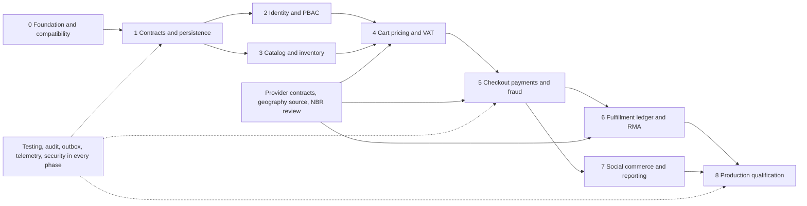

# Section 3: Phased Implementation Roadmap Day 1 to Production

This is the execution companion to the [enterprise architecture](ecommerce-blueprint.md) and [relational schema](ecommerce-schema.sql). The paths below are proposed implementation destinations unless the baseline table explicitly identifies an existing file. This deliverable does not install dependencies, apply migrations, provision infrastructure, or enable integrations.

## Baseline and implementation rules

The repository inspected for this plan is an existing working monorepo, not an empty scaffold:

| Evidence | Current state | Required treatment |
| --- | --- | --- |
| Root `package.json`, `pnpm-workspace.yaml` | Workspace `aaraj`; `pnpm@12.5.1`; Node `>=24.15.0 <25` | Preserve topology and lockfile; use the workspace package names below. |
| Execution environment | Node `v24.19.0`, pnpm `12.5.1` observed during blueprint preparation | Recheck on the implementation machine; an environment observation is not a promise about CI or production. |
| `apps/api/package.json` | Nest packages declared `^12.0.1`; pure ESM; Vitest and Oxlint | Verify installed and locked versions, including peers, before adding framework extensions. |
| `apps/api/tsconfig.build.json` | Production `rootDir` is `src`; compiled entry exists at `apps/api/dist/main.js` | Keep `start` / `start:prod` semantics. Do not use `dist/src/main.js`. |
| `apps/api/src/main.ts`, `configure-app.ts`, `app.module.ts` | Existing bootstrap, `/api` prefix, CORS and health/status scaffold | Modify incrementally; do not generate a replacement Nest application. |
| `apps/web/package.json` | Next.js storefront, not Vite | Follow `apps/web/AGENTS.md` before frontend edits. Retain Next.js unless a separate architecture decision justifies migration. |
| `packages/contracts/src/index.ts` | Existing health, money, product and order-status schemas and tests | Preserve exports while introducing versioned contracts; expand tests before changing existing semantics. |
| API dependencies | No database driver, ORM, Redis client, queue, configuration or payment integration dependency yet | Treat every new dependency as an explicit reviewed addition, not an assumed installed capability. |
| `.github/workflows/ci.yml` | Frozen install, shared build, typecheck, lint, tests, API E2E and production build already exist | Extend this workflow. Do not replace working gates with a generic pipeline. |
| `docs/backend/` | Internal reference suite with examples | Follow the standards; validate code examples against the lockfile. The Docker chapter's root `tsconfig.json` and `dist/src/main.js` do not match this repository's `tsconfig.base.json` and `dist/main.js`. |

Choose **PostgreSQL + `pg` + `drizzle-orm`** behind explicit Nest injection tokens. Domain repositories own their SQL and schema imports. Use reviewed, ordered SQL migrations for partitions, deferred constraints, functions, privileges and concurrent indexes. A Drizzle schema describes the tables for typed queries; it does not authorize automatic production schema synchronization. The optional `@nestjs/drizzle` integration, and the requested `@nestjs/outbox`, require a successful version/peer/ESM spike before adoption; retain the outbox semantics even if a local adapter is needed.

Every new relative TypeScript import ends in `.js`, including tests and public exports. Reuse runtime symbols such as `CATALOG_PORT` with `@Inject(CATALOG_PORT)` for interfaces. Domain entities cannot import Nest, Redis, `pg`, ORM tables or HTTP clients. Shared contracts expose schemas, event envelopes and public DTOs, never repositories or persistence entities. See [ESM conventions](../backend/migration/04-esm-migration-playbook.md), [provider tokens](../backend/fundamentals/01-custom-providers.md), [module boundaries](../backend/overview/04-modules.md) and [Drizzle reference](../backend/data/03-drizzle.md).

The phase titles follow the requested sequence, but security, testing, idempotency, audit and durable events begin with the first mutation. Phase 6 expands an existing outbox; Phase 7 expands an existing audit system; Phase 8 qualifies existing resilience and tests for production.

## Planning assumptions, dependencies and ownership

Planning envelope: two backend engineers, one frontend engineer, one platform/SRE engineer, a QA engineer, and part-time security, product/operations and Bangladesh finance/tax specialists. With this staffing, treat roughly **24–36 calendar weeks** as a capacity-planning range for the complete enterprise scope, including overlapping work. It is not a launch commitment. Provider onboarding, signed courier contracts, sanctioned gateway test accounts, verified geographic data and tax approval can determine the critical path. Re-estimate after Phase 1 and after the first sandbox payment.

Assign named people to these roles in `docs/delivery/owners.md`: architecture lead (**ARCH**), platform/SRE (**PLAT**), backend/domain engineers (**BE**), storefront/admin engineers (**FE**), quality engineering (**QA**), security (**SEC**), commerce operations (**OPS**), finance/tax (**FIN**), and product (**PM**). Each exit gate has one accountable owner even when several teams implement it.



Identity and catalog implementation can proceed in parallel once contracts and ownership are accepted. Phase 7 consent and analytics design may begin earlier, but it must not emit a purchase before the authoritative business transition. Provider adapter spikes and tax discovery should start in Phase 0 while product work proceeds independently.

## Phase 0 — Infrastructure, Secrets & Security Foundation

**Planning range:** 1–2 weeks. **Accountable:** PLAT. **Prerequisites:** repository access and environment owner; implementation approval is separate from this documentation deliverable.

Ordered backlog:

1. Record `docs/decisions/0001-modular-monolith.md`, `0002-money-idempotency-events.md`, `0003-database-and-migrations.md`, `0004-infrastructure-and-secrets.md`, and `0005-dependency-compatibility.md`. Use the main blueprint's AWS reference deployment (ECS/Fargate, ALB, RDS Multi-AZ, managed Redis, S3/CloudFront, Secrets Manager/KMS); record any replacement as an explicit alternative. Record ownership of all 36 pillars; forbid cross-context repository/table imports and runtime cross-context SQL joins. Define contract versioning and deprecation rules.
2. Reproduce the existing CI checks with the locked Node/pnpm toolchain. Record installed versions and smoke-test NodeNext import behavior, `StandardSchemaValidationPipe`, and each proposed Nest add-on before accepting it. Inspect registry metadata, license, advisory status, package integrity and peer ranges for the exact selected versions. Do not run unversioned bulk `add` commands from documentation examples.
3. Create the local development templates in Section 4: PostgreSQL 16+, separate Redis state and cache services, persistent local volumes, loopback-bound ports, and explicit health checks. This is a developer bootstrap, not HA infrastructure.
4. Build `apps/api/src/platform/config/config.schema.ts`, `config.module.ts`, and `secrets/secrets.port.ts`; add validated `ConfigModule` wiring to the existing `app.module.ts`. Fail startup on missing secrets, malformed URLs, unsafe production CORS, invalid ports, or contradictory feature flags. Never log resolved configuration. `.env.example` contains names and development-only values; staging/production resolve short-lived credentials through workload identity and Secrets Manager or Vault.
5. Build `apps/api/src/platform/http/{correlation.middleware.ts,http-exception.filter.ts,request-limits.ts}`, `platform/security/{security.module.ts,redaction.ts}`, and the first redaction tests. Add strict origin allowlists, Helmet, HTTPS/HSTS at the edge, body/URL/header size limits, a restrictive query parser, raw-body limits for signed webhooks, and explicitly trusted proxy ranges. Bind DI-dependent global guards/pipes/filters/interceptors through `APP_*` providers. Do not trust arbitrary `X-Forwarded-For` or arbitrary correlation IDs.
6. Establish Redis-backed rate policies: browsing **120/min**, authentication **5/min**, checkout/payments **10/min**; key authenticated routes by principal and anonymous traffic by trusted IP/session plus purpose-specific phone/device limits. Define failure behavior: authentication and money mutations fail closed when enforcement is unavailable; cached public catalog reads can degrade under edge limits. Test deployment across multiple API replicas.
7. Create `infrastructure/terraform/modules/{network,database,redis,secrets,object-storage,compute,observability}/` and `infrastructure/terraform/environments/{staging,production}/`. Specify encrypted private networking, multi-AZ primary/standby database, PgBouncer, independent cache/queue/state capacity, TLS, least-privilege service identities, log retention and encrypted remote Terraform state with locking. Separate state and credentials by environment; enforce reviewed plan/apply roles.
8. Add `infrastructure/pgbouncer/{pgbouncer.ini.example,README.md}` and a connection-budget ADR. Budget API instances × pool size, workers, migrations and emergency reserve against PostgreSQL limits. Use transaction pooling for application traffic; direct PostgreSQL connections for migrations and long maintenance operations. Verify prepared-statement behavior with the selected PgBouncer/driver configuration. Keep authentication/financial/inventory reads on the primary.
9. Extend `.github/workflows/ci.yml` with secret scanning, dependency/license/SBOM checks and a database-backed integration job only after its config exists. Create `docs/runbooks/{local-development,secret-rotation,incident-triage}.md`. Add budget alerts for SMS, object storage and external gateway requests before enabling providers.

**Exit gate:** PLAT and SEC accept a reproducible clean checkout; separate environment boundaries; a demonstrated secret rotation; rejected unsafe configuration; cross-instance throttling; masked synthetic PII in logs/spans/errors; and baseline CI evidence. No internet-facing mutating commerce endpoint is enabled yet. PgBouncer and HA are required for the staging environment, even though the Day 1 local template bypasses them.

References: [configuration](../backend/application/01-configuration.md), [security headers](../backend/security/04-security-headers.md), [rate limiting](../backend/security/07-rate-limiting.md), [deployment health checks](../backend/deployment/04-health-checks-terminus.md).

## Phase 1 — Domain Contracts & Persistence

**Planning range:** 2–3 weeks. **Accountable:** ARCH. **Prerequisites:** Phase 0 security baseline and compatibility decision.

Ordered backlog:

1. Split new schemas into `packages/contracts/src/{common,identity,catalog,inventory,cart,pricing,order,payment,fulfillment,notification,audit,moderation,courier-ledger,geography,support}/`. Preserve existing `index.ts` exports until clients migrate. Version money, address, pagination, problem details, event envelopes and state-transition inputs. Enforce strict objects, bounded strings/arrays, prohibited keys, safe integer JSON amounts, known currency codes and UTC timestamps. Use `bigint` internally for monetary arithmetic; validate safe integer bounds when serializing a JSON number.
2. Implement `apps/api/src/platform/database/{database.module.ts,database.tokens.ts,transaction.ts,migration-policy.md}` with `pg`/Drizzle, pool shutdown, statement/lock/idle-transaction timeouts and separate primary/replica read capabilities. A base repository may provide mechanical helpers only; it cannot offer arbitrary cross-context table access. Create an explicit repository per aggregate.
3. Start `apps/api/migrations/0000_bootstrap.sql` exactly as Section 4 describes, then review owner-by-owner migrations derived from the [proposed schema](ecommerce-schema.sql). That reference DDL is an architectural specification for an empty database, not permission to apply it to an existing environment. One controlled migration runner owns history; import the Day 1 checksum into the eventual runner instead of starting an unrelated ORM journal.
4. Create immutable geographic dataset metadata and `geography.divisions`, `districts`, `upazilas`, `areas`, and provider zone mappings. Implement `apps/api/src/modules/geography/{domain,application,infrastructure,ingress}/` plus `public.ts`. Record source/license/version, distinguish thana/upazila and area/union types, validate parent-child links, retain renamed/historical entries and map courier zone identifiers by provider and dataset version. Do not assume courier zones are universal geographic IDs. Seed only reviewed source data, never invented complete Bangladesh coverage.
5. Install the shared **protocol**, with separate owner storage, for `command_receipts`, `outbox_events`, `outbox_event_ids`, `consumer_inbox`, and audited event envelopes. A command stores its durable result/business uniqueness and event in the same owner transaction. Redis holds the required 24-hour response cache and lock; it is never the sole duplicate-prevention record. Namespace idempotency by authenticated principal or signed guest session, route and command purpose; bind the payload fingerprint; mask or encrypt any stored PII response.
6. Add `apps/api/src/platform/idempotency/{idempotency.interceptor.ts,idempotency.store.ts,request-fingerprint.ts}`, `platform/events/{outbox.port.ts,outbox-relay.ts,inbox.ts}`, and `modules/audit/`. Require `Idempotency-Key` for every first-party mutating route, including cart, identity requests, inventory and administration. Provider webhooks cannot be forced to invent this header: verify signatures, then derive an internal idempotency key from their stable event or transaction identity and persist a unique inbox receipt. Provide a documented, equivalent identity for internal jobs.
7. Build a minimal relay/consumer vertical slice before catalog writes exist. Publish after commit; claim with `FOR UPDATE SKIP LOCKED`, bounded leases and fencing; send at least once; inbox deduplication and business uniqueness make effects safe. An in-process emitter provides local notification after durable commit, not durable delivery. Set initial retry/DLQ handling and queue lag alarms now.
8. Implement append-only audit ingestion before creating an admin write endpoint. Store safe before/after diffs and references to encrypted sensitive data. Use a runtime role that cannot update/delete audit rows; seal signed batch roots into separately administered immutable storage. Test tamper detection and access controls. Do not promise that an ordinary table can resist its database superuser.
9. Establish partition creation/retention jobs for orders, audit and outbox, partition-inclusive keys and globally unique identity registries. Prove inserts before/after month boundaries, late-arriving events and future partition creation. Establish expanding migrations, backfill checkpoints and role grants per owner.

**Exit gate:** ARCH accepts a reviewed ownership graph and import-boundary CI rule; database constraints reject inconsistent money/address/stock data; migration checksums and repeat execution work; a worker crash between database commit and publication loses no event; duplicate consumption changes business state once; Redis loss cannot duplicate a durable command; an administrative mutation has attributable, redacted audit evidence. Geography has a source/version and complete parent integrity for the initial service area.

References: [validation](../backend/application/02-validation.md), [idempotency](../backend/reliability/02-idempotency-keys.md), [outbox](../backend/reliability/03-transactional-outbox.md), [events](../backend/application/05-events.md). Interpret any reference claims of “exactly once” as application-level effects under these persisted deduplication rules, not an end-to-end network guarantee.

## Phase 2 — Phone-First Identity & PBAC

**Planning range:** 2–3 weeks, partly parallel with Phase 3. **Accountable:** SEC, implementation BE/FE. **Prerequisites:** owner persistence, audit, idempotency and notification skeleton.

Ordered backlog:

1. Implement `modules/identity/domain/{phone.ts,otp-policy.ts,session.ts,permission.ts}` and Zod request/response contracts. Normalize BD numbers to E.164 and enforce the intended mobile pattern `^\+8801[3-9]\d{8}$` at the policy boundary. Keep a configurable country allowlist for future markets. Store encrypted phone values with a keyed lookup hash; do not treat a phone number as immutable lifetime identity.
2. Verify Turnstile on the server with the expected hostname/action and a bounded timeout before spending SMS credit. Integrate a typed `fetch` adapter for the selected SMS gateway with per-phone/IP/device/prefix limits, resend cooldown, daily spend ceiling and kill switch. Generate OTPs cryptographically and store a keyed HMAC under a server-held secret, expire quickly, bind to session/purpose and atomically limit failed attempts. Reject replay and concurrent double redemption. Responses must not expose account existence.
3. Implement short-lived access tokens, rotating refresh sessions, theft/reuse revocation, signing-key rotation and secure cookie/CSRF policy. Redact OTP/password/token material before log or tracing instrumentation. Bind anonymous mutation scopes to signed opaque sessions before login and preserve the cart merge key across authentication.
4. Implement `PermissionsGuard`, resource-ownership checks and a permission registry; create role bundles for SuperAdmin, OperationsManager, CatalogEditor, CustomerSupport, FraudAnalyst and Customer. Default deny both customer and admin endpoints. Permission examples: `refund.authorize`, `identity.roles.assign`, `pricing.override`, `inventory.adjust`, `order.risk.review`, `support.impersonate`.
5. Implement TOTP enrollment confirmation, encrypted secrets, hashed single-use recovery codes, replay prevention, clock-window limits and audited recovery. Require recent step-up verification for refunds, role changes and price overrides; MFA enrollment alone is insufficient. Make emergency access time-bound and reviewed.
6. Build the initial admin shell and customer session UI under the current Next.js route conventions. Add accessible Bangla/English text, masked phone display, resend timers and explicit challenge expiry. Avoid logging full API payloads in browser monitoring.

**Exit gate:** SEC accepts OTP pumping simulations and spend controls, atomic challenge redemption, session theft/revocation behavior, CSRF tests where cookies authorize mutations, resource-level authorization, and step-up failure tests for each sensitive action. QA verifies all six roles against the permission matrix, including negative cases. No real SMS broadcast occurs during these tests.

References: [authentication](../backend/security/01-authentication.md), [authorization](../backend/security/02-authorization.md), [encryption/hashing](../backend/security/03-encryption-hashing.md), [CSRF](../backend/security/06-csrf-protection.md).

## Phase 3 — Catalog, Trigram Search & Media Pipeline

**Planning range:** 3–4 weeks. **Accountable:** BE catalog/inventory owner. **Prerequisites:** Phase 1; Phase 2 gates administrative publishing.

Ordered backlog:

1. Implement `modules/catalog/` products, variants, categories, brands, attribute definitions and publication workflow; expose public query ports and immutable commerce snapshots. Put schema indexes/migrations beside the owner, not into shared contract packages.
2. Implement `pg_trgm` search and GIN JSONB attributes, indexed facet values, explicit pagination/maximum result sizes, normalized Bangla/English search terms and typo thresholds. Define zero-result fallbacks without silently removing important constraints. Benchmark explain plans using representative catalog sizes; retain a search-port adapter boundary for a later dedicated engine.
3. Implement `modules/inventory/` warehouse stock, movements, reservations, expiration and reconciliation. `physical >= reserved >= 0`, `available = physical - reserved`, and `available >= 0` must be database-enforced. Lock SKU/warehouse rows in a deterministic order. Redis Lua admission reduces flash-sale contention; a successful Redis operation is not a stock promise until the database transaction commits.
4. Define bounded reservation lifetime, checkout-extension policy, owner-command idempotency and fenced release/commit commands. Rebuild Redis counters from PostgreSQL after loss or discrepancy; decline or slow checkout while admission state is uncertain. Do not release stock on a timer without verifying the durable reservation state and version.
5. Implement `modules/catalog/infrastructure/media/` signed upload initiation, MIME/content validation, byte/pixel limits, malware scanning where relevant, private originals, transformation jobs and AVIF/WebP/responsive derivatives. Use immutable content/version URLs for CDN invalidation; set explicit cache controls. Isolate untrusted image parsing from API workers.
6. Add cache singleflight with bounded waits, jittered TTL, stale-while-revalidate policy and stale-size limits. Implement storefront list/search/product detail pages, accessible filters, image dimensions, fallback text and versioned OpenGraph cards. CMS content cannot override authoritative price or availability.

**Exit gate:** QA proves no oversell under contending reservations, timeout/retry, process crash and Redis restart; database invariants hold. Catalog query plans and image limits are reviewed, cache stampedes are bounded, and a stale product view cannot bypass checkout revalidation. Inventory adjustments require reason, permission, idempotency and audit.

## Phase 4 — Cart, Pricing & NBR Tax Compliance

**Planning range:** 3–4 weeks. **Accountable:** commerce BE, with FIN accountable for tax rules. **Prerequisites:** identity, catalog and inventory public ports.

Ordered backlog:

1. Implement `modules/cart/` signed anonymous cart handles with a **7-day TTL**, durable customer carts, schema/versioned cart contents, maximum lines/quantities and deterministic login merging. Set a one-time durable merge command receipt; merge simultaneous guest/login requests without duplicating quantities. Cart lines reference catalog IDs and display snapshots, while checkout recalculates authority.
2. Build `modules/pricing/domain/{money.ts,rounding.ts,allocation.ts,tax.ts,promotion.ts}` with integer/bigint arithmetic only. Represent percentages as basis points or rational numerator/denominator. Define inclusive/exclusive VAT, line/order rounding, deterministic largest-remainder allocation, shipping allocation and proportional refunds. Convert third-party decimal strings without `parseFloat`, division into fractional currency numbers or rounding a floating-point intermediate.
3. Implement time-windowed flash sales, quantity tiers, bundles, coupon eligibility, global/per-customer quotas, anti-stacking and priority rules. Lock or conditionally decrement quotas at checkout; a cart preview does not consume inventory or guarantee a coupon. Store the rule version, inputs and line allocations in the final order snapshot.
4. Build geographic delivery quotations using the four-level address hierarchy and verified provider serviceability mappings. Support locality text/instructions safely, validate phone/address fields and show explicit out-of-stock/repricing notices. Require reconfirmation for material price changes; do not silently charge a newer quote.
5. Add versioned, effective-dated VAT rules, merchant/BIN settings, exempt/rate classifications, taxable base and adjustment records. Draft Mushak 6.3 renderer/export in `modules/pricing/application/invoicing/` against the official form and the merchant's approved treatment. FIN signs off invoice fields, sequencing, rounding, translations and correction/refund workflow before any claim of compliance. No hardcoded universal Bangladesh VAT rate.
6. Add unit/property-style tests for largest-remainder allocation, caps, currency mismatch, integer overflow, cancellation/refund reversals and quote expiration. Configure **100% statements, branches, functions and lines for money and state-transition algorithm files**, with no unexplained ignored branches. Integration tests remain necessary even at 100% coverage.

**Exit gate:** FIN approves representative tax/invoice cases and the effective-date/version process. QA proves conservation of subunits across discounts, tax, settlement and partial refunds; coupon quotas withstand concurrency; login merging is idempotent; checkout sees current prices and serviceable addresses. A versioned quote can be reproduced from its recorded inputs.

## Phase 5 — Checkout State Machine, MFS Payments & COD Risk

**Planning range:** 4–6 weeks, subject to provider onboarding. **Accountable:** order/payment BE; FIN owns settlement acceptance. **Prerequisites:** pricing snapshot, inventory reservations, identity, audit/outbox and first provider sandbox.

Ordered backlog:

1. Implement `modules/order/domain/` explicit transition tables, separate payment/fulfillment state, order acceptance rules, quote expiry and cancellation/compensation. Build checkout as a persisted workflow using module public commands and events. Do not read/write other modules' tables or hold database locks across provider HTTP calls.
2. Enforce universal mutation idempotency established in Phase 1 at storefront, admin and internal command boundaries. A reused key with changed payload fails; a running command returns a retryable conflict; a completed command replays its safe durable result. A Redis lease timeout cannot authorize a duplicate payment. After the 24-hour cache expires, stable payment/order business identifiers still deduplicate effects.
3. Implement `modules/payment/application/payment-provider.port.ts` and `infrastructure/providers/{bkash,nagad,sslcommerz,aamarpay}/`. Each adapter uses Node native `fetch` or a verified maintained HTTP client, explicit request/response schemas, abort deadlines, token caching, bounded retries and a circuit breaker/bulkhead. Do not install unmaintained CommonJS gateway wrappers. Implement only provider-confirmed signing/encryption/authentication procedures from merchant documentation; never invent a shared “HMAC webhook” protocol.
4. Treat browser return URLs as navigation only. Authenticate and persist webhook receipts before acknowledging; verify merchant account, currency, amount and provider transaction identity through the provider's supported verification/query API. Handle duplicate, delayed, missing, out-of-order and contradictory callbacks; persist an `UNKNOWN`/pending outcome on network ambiguity and reconcile before any new charge.
5. Schedule two reconciliation paths: transaction status for unresolved attempts and financial settlement/report reconciliation. Lock work claims, keep stable operation IDs, and store redacted evidence and discrepancy queues. An HTTP timeout is not proof that a provider action failed.
6. Implement `modules/order/application/cod-risk/` transparent risk rules using historical RTS, first-order status, velocity and approved signals. Configure the requested courier advance as **10,000–15,000 BDT subunits (৳100–৳150)**, subject to quotation/merchant policy. Explain the advance before payment. Deduct a captured advance from delivery collectable; record treatment on cancellation, delivery failure and refund. Never collect the full COD amount after taking an advance.
7. Quarantine suspect orders with `FLAGGED_FOR_REVIEW`, reason codes, restricted evidence and review deadlines. Provide Operations/FraudAnalyst approve/reject/ask-for-confirmation actions, recent MFA where required, audit and customer communication. Avoid opaque automatic punishment based on unvalidated proxies; record rule versions and reviewer overrides.
8. Finish the mobile checkout UI with persisted idempotency keys, resumable pending payment, clear paid/pending/advance-required states, network retry guidance and accessibility. Keep payment credentials and tokens out of client URLs, analytics and support screenshots.

**Exit gate:** QA and FIN demonstrate prepaid, normal COD, partial-advance COD, payment timeout, late capture after cancellation, duplicate callback, stock expiration, refund and manual review journeys. Each results in one authoritative order/payment effect, conserved money and explainable audit. A provider outage does not exhaust API or worker concurrency. Merchant sandbox certification and credential custody are signed off before real payments.

References: [HTTP adapters](../backend/application/08-http-client.md), [raw-body verification](../backend/faq/05-raw-body.md), [resilience](../backend/reliability/01-resilience.md).

## Phase 6 — Logistics, Multi-Warehouse & Courier Ledger

**Planning range:** 4–5 weeks. **Accountable:** fulfillment BE and OPS; FIN owns reconciliation rules. **Prerequisites:** stable order/payment events and provider-approved logistics accounts.

Ordered backlog:

1. Expand the **existing** outbox/inbox to warehouse allocation, packing, booking, tracking, ledger and return workflows. Verify per-aggregate sequence/version handling, lease recovery, poison-message quarantine and replay compatibility across releases. Never make in-process event emission the only order-to-fulfillment handoff.
2. Implement allocation policy over Inventory's public availability/reservation commands: serviceability, stock, dispatch cutoff, shipping cost and operational priority. Record deterministic decisions and reservation IDs; produce shipment-level allocations and independent tracking, while the parent order retains its original financial identity. Split taxes, discounts, delivery fees and COD collectable by recorded subunit allocations.
3. Implement `modules/fulfillment/infrastructure/couriers/{pathao,steadfast,redx}/` typed adapters. Use official zone mappings, stable merchant references and verified label formats; record unknown booking outcomes and query before retrying. Do not assume the courier supports an idempotency header. Deduplicate tracking events and map provider status codes through a versioned table without losing the raw normalized code.
4. Add label generation, packaging/weight rules, handover manifests, pickup cancellation, partial delivery and RTS transitions. Use signed webhook validation where available and bounded BullMQ polling for missed updates. Track source timestamp, received timestamp and monotonic shipment version; late “in transit” must not undo delivered/returned final state.
5. Implement `modules/courier-ledger/` double-entry control accounts, courier receivables, COD commissions, delivery/return fees, advance offsets, remittances, settlement batches, adjustments and exceptions. **1% is a configurable contract example**, not a universal commission. Validate unique report lines and report hashes; match by provider/consignment/reference, currency and amount. Do not mark an order remitted merely because delivery was confirmed.
6. Implement `modules/fulfillment/application/rma/` eligibility, partial quantities, doorstep refusal/RTS, inspection grades, restock/dispose, permitted fees and refund authorization. Reuse the original line allocations and cap total returned/refunded quantities and money. A return receipt alone does not restore saleable stock; inspection acceptance does. Prevent concurrent duplicate refunds using both durable commands and ledger constraints.
7. Expand `modules/notification/` queue adapters for transactional SMS, WhatsApp and email, with per-channel templates, retry classification, bounded exponential backoff/jitter, DLQs and provider receipts. Apply circuit breakers and spend budgets per channel. Notifications must not block order commit.

**Exit gate:** OPS proves a Dhaka/Chattogram split shipment, courier booking ambiguity, missed webhook recovered by polling, RTS, partial delivery and graded return. FIN signs balanced ledgers, repeated statement imports without duplicates, advance deduction, fee/commission allocation and a real sandbox discrepancy investigation. QA proves an outbox/queue worker can crash and replay each workflow safely.

Reference: [queues](../backend/application/07-queues.md), [distributed locks](../backend/reliability/04-distributed-locks.md).

## Phase 7 — CAPI Tracking, Audit Logging & Social Commerce

**Planning range:** 2–3 weeks, partly parallel with later Phase 6. **Accountable:** FE/BE customer-experience owner; SEC/OPS review. **Prerequisites:** authoritative purchase/shipping transitions, permission matrix and consent model.

Ordered backlog:

1. Implement `modules/notification/application/analytics/` with purpose-specific consent, an allowlisted event schema, retention, server-side Meta CAPI and GA4 adapters, stable event IDs and browser/server deduplication. Emit purchase once at the documented commercial milestone and corrections/refunds with distinct IDs. Separate consented tracking from operational order processing. Hashing contact details does not remove their sensitivity; never place them in ordinary telemetry.
2. Build `modules/notification/ingress/social/` WhatsApp Business and Messenger verified webhook ingestion, durable provider inboxes, identity linking with user confirmation and channel state. Social orders invoke the same cart/quote/checkout commands, permissions and risk rules as storefront orders. A sender ID is not proof of ownership of an existing customer account. Support template/session constraints and opt-out rules from the selected provider's current documentation.
3. Extend existing audit ingestion with searchable operator timelines, filters, export authorization, tamper-verification jobs, WORM retention and incident access. Record sensitive read/export events and impersonation, not only writes. Avoid full unredacted before/after snapshots.
4. Implement `modules/moderation/` reviews, profanity/spam screening, report/appeal workflow and authorized publication changes. Build back-office cursor pagination and constrained bulk commands with preview, per-item results, independent idempotency and audit.
5. Implement `modules/support/` CRM read projections from public events: orders, payments, shipping, communication and ticket references. Expose manual address correction only before dispatch and through the order/fulfillment public workflow; invalidate/requote zone/fees and update pending consignments as required. Record the customer request and exact change.
6. Add time-boxed support impersonation with explicit reason, original operator identity, visible UI banner, least privilege and termination. Prohibit payment credential access, MFA changes, privilege assignment and sensitive financial actions under impersonation. Enable security review and customer-facing notification according to approved policy.
7. Add DLQ monitoring/triage UI and alert routing to configured PagerDuty/Slack/Discord endpoints. Replays require permission, reason, preview and stable original event identity; preserve the replay audit. Document a queue's retry versus quarantine decision, alert severity, on-call owner and maximum age.

**Exit gate:** PM/SEC approve consent behavior, browser/server deduplication and social identity linking. OPS can investigate one customer timeline without exposing full payment/OTP/address data; bulk actions and impersonation produce attributable audit. Failed jobs page the configured on-call test sink and can be replayed without duplicated financial effects.

## Phase 8 — Production Hardening, Disaster Recovery & Automated Testing

**Planning range:** 3–5 weeks; foundational work begins in Phase 0. **Accountable:** PLAT release owner. **Prerequisites:** Phase 5–7 business acceptance and signed provider/finance/security decisions.

Ordered backlog:

1. Extend `.github/workflows/ci.yml` with real PostgreSQL/Redis integration tests, an API/web contract compatibility gate, algorithm coverage enforcement, image/SBOM scanning, verified build provenance and immutable artifact promotion. Add `apps/api/vitest.config.integration.ts` and `test:integration` only when the integration suite exists; do not assume they exist today. Keep API `test`, `test:e2e` and `test:cov` scripts and the existing unit/E2E filename split. Add frontend E2E tooling through a reviewed dependency change.
2. Create `apps/api/test/{checkout,inventory-concurrency,payment-reconciliation,refund-rma,outbox-crash,migration-compatibility,pii-redaction}.e2e-spec.ts` or appropriately isolated integration files. Extend Vitest includes/excludes so real-service tests do not silently run against mocks or run twice. Set 100% coverage on the financial/state algorithm scope explicitly; use risk-based coverage elsewhere.
3. Build `tests/load/` scenarios for catalog browsing, flash-sale contention, OTP abuse, checkout and webhook bursts. Establish a measured workload model and capacity target before asserting an SLO. Initial candidate targets for review: 99.9% monthly storefront/checkout availability, catalog p95 under 300 ms at origin and checkout acceptance p95 under 800 ms, excluding separately reported external payment latency. Measure p99, error budget, DB lock wait, pool saturation, replica lag, outbox age, queue age and provider error rates.
4. Validate all outbound adapters' deadlines, retry safety, jitter, bulkheads, circuit-breaker recovery and graceful degradation under latency, DNS errors, 429s, inconsistent payloads and outage. Cached catalog can serve stale content within policy; checkout cannot invent available stock or payment success. Alert on reconciliation backlog and ambiguous payments independently of HTTP uptime.
5. Build `apps/api/Dockerfile`, `apps/web/Dockerfile` and `.dockerignore` against actual workspace output. Copy `tsconfig.base.json`, build `@aaraj/contracts` first, retain runtime workspace exports and validate `node apps/api/dist/main.js`. Use a digest-pinned Node 24 image, non-root user, init/signal handling, read-only filesystem where supported and no embedded secrets. Test the final image, not just the builder stage.
6. Separate API and worker process entrypoints, with independent autoscaling and concurrency/pool budgets. Add readiness for critical dependencies, liveness that does not restart every instance on a shared database outage, startup probes, graceful drain, queue lease handling and termination deadlines. Keep expensive provider checks out of liveness probes.
7. Implement continuous encrypted WAL archiving and scheduled base backups into separate-account/offsite storage, measured archive lag, backup freshness and restore testing. Demonstrate **RPO <5 minutes and RTO <30 minutes** from incident declaration to verified service restoration at realistic data volume. Measure a restore; a successful backup upload is not evidence of the target.
8. Create `docs/runbooks/{database-failover,pitr-restore,regional-disaster,read-only-mode,queue-replay,payment-reconciliation,courier-settlement,migration-rollback}.md`. Separate rapid multi-AZ failover from regional disaster recovery. Measure cross-region replication lag; fence old writers, promote deliberately, rotate endpoints/credentials and prevent split brain. Trigger read-only maintenance when authoritative writes cannot be trusted. Rebuild cache/search, resume outbox and reconcile provider-side actions after failover; do not blindly replay payments from restored snapshots.
9. Rehearse expand-and-contract: additive compatible schema → deploy code that handles old/new → bounded observable backfill → validation → switch readers/writers → wait rollback window → later contract release. Run N and N−1 application versions against the expanded schema. Put concurrent indexes in appropriately nontransactional migration steps. Configure lock timeouts and abort criteria; do not promise instantaneous rollback after destructive schema removal or external side effects.
10. Complete penetration testing, abuse testing, dependency review, provider credential rotation, PII inventory/retention/deletion procedures, tax sign-off, customer policies and operational training. Schedule limited-traffic canary with roll-forward/rollback thresholds, financial reconciliation checkpoints and an assigned incident commander. External launch/deployment is an operational decision after these artifacts are reviewable.

**Exit gate:** PLAT accepts the signed launch evidence below; FIN signs settlement and tax; SEC signs authorization/PII; OPS signs fulfillment/returns/on-call. A known critical money, inventory, authorization, backup or reconciliation defect blocks launch regardless of headline coverage or performance.

### Required test and release evidence

| Layer | Concrete evidence | Blocking failure |
| --- | --- | --- |
| Contracts | Same versioned Zod schema accepts/rejects API and web fixtures; unknown keys, malformed phones, currency mismatch and oversized input rejected | Divergent client/server behavior or unsafe numerical boundary |
| Pure algorithms | 100% measured financial/state algorithm coverage; randomized conservation checks; overflow/rounding edges | Lost subunit, invalid transition, non-reproducible price/refund |
| PostgreSQL integration | Actual constraints, row locks, partition routing, idempotency receipts, inbox and transaction rollback | Oversell, duplicate effect, orphan financial identity |
| Redis integration | Atomic throttling/Lua, TTL policy, Redis restart/eviction behavior and rebuild | Redis loss allows duplicate charge or negative stock |
| Provider contract tests | Redacted official sandbox fixtures plus timeouts, malformed bodies, duplicate/out-of-order callbacks | Browser-return trust, unverified capture, blind retry of ambiguous action |
| E2E/Supertest | Browse → OTP → cart merge → quote → prepaid/COD/advance → dispatch → return/refund; six-role denial matrix | Broken purchase funnel or unauthorized mutation |
| Event chaos | Kill before/after commit, before/after enqueue, during consumption; replay both old and new event versions | Lost committed work or unsafe replay |
| Migrations | Fresh database + upgrade from previous release + N−1 compatibility + backfill restart + partition rollover | Unbounded table lock or incompatible rollback window |
| Telemetry/security | Synthetic PII absent from logs/spans/errors; secrets never in artifacts; access checks on tracing/audit exports | Sensitive value leak or absent actor attribution |
| Recovery | Timestamped PITR restore, fenced failover, outbox/inbox replay and provider reconciliation at realistic scale | RPO/RTO missed or split-brain/duplicate external action |
| Operations | DLQ, queue age, reconciliation discrepancy and SMS-spend alerts reach a test destination; documented acknowledgement | Silent money/queue backlog or absent on-call owner |
| Load/release | Signed load baseline, pool budget, canary rollback evidence and independent artifact verification | Error-budget breach, exhaustion or unverified production image |

### Coverage of the 36 requested pillars

The phase shown first introduces the capability; later phases extend or qualify it.

| Pillar | Delivery phases | Accountable owner / acceptance artifact |
| --- | --- | --- |
| 1. Bounded contexts | 0, 1, all | ARCH / ownership map and boundary test |
| 2. PostgreSQL HA and partitions | 0, 1, 8 | PLAT / pool budget, partition and failover tests |
| 3. PBAC/MFA | 2, 7 | SEC / six-role matrix and step-up tests |
| 4. Validation/ingress | 0, 1 | SEC / hostile input and contract tests |
| 5. Distributed throttling | 0, 2, 5 | SEC / multi-instance quota and fail-closed tests |
| 6. Secrets/IaC | 0, 8 | PLAT / reviewed plan and rotation proof |
| 7. Concurrency stock | 3, 5, 6 | BE / oversell and reconciliation tests |
| 8. Search/facets | 3 | BE / relevance fixtures and explain plans |
| 9. Dynamic pricing/flash sales | 3, 4 | BE / concurrency and quote-version tests |
| 10. Media/CDN/OG | 3 | FE / transformation and cache acceptance |
| 11. Hybrid cart | 4 | BE / merge retry and expiry tests |
| 12. Subunit math | 1, 4 | FIN / integer boundary and conservation proof |
| 13. Coupons/discounts | 4, 5 | FIN / quota/stack/allocation fixtures |
| 14. Phone/OTP/toll-fraud | 2 | SEC / Turnstile and spend-limit tests |
| 15. COD advance/risk | 5, 6 | OPS / advance-to-COD reconciliation |
| 16. MFS/gateway adapters | 5 | FIN / sandbox and dual-reconciliation acceptance |
| 17. BD address hierarchy | 1, 4, 6 | OPS / sourced geography and courier mapping |
| 18. VAT/Mushak 6.3 | 4, 8 | FIN / approved versioned invoice samples |
| 19. Conversational commerce | 7 | PM / verified social order journey |
| 20. Transactional outbox | 1, 6 | ARCH / crash and duplicate-consumption tests |
| 21. Warehouses/splits | 3, 6 | OPS / split allocation and collection totals |
| 22. Couriers/polling | 6 | OPS / booking ambiguity and missed-webhook recovery |
| 23. COD ledger | 6 | FIN / balanced entries and report reimport |
| 24. RMA | 6 | OPS / graded stock and capped partial refund |
| 25. Notifications | 1, 2, 6 | BE / retry, deduplication and delivery receipts |
| 26. Fraud/quarantine | 5, 7 | SEC / explainable review/appeal workflow |
| 27. Immutable audit | 1, 2, 7 | SEC / access restriction and tamper detection |
| 28. Administration/moderation | 2, 7 | OPS / bulk commands and impersonation audit |
| 29. Support CRM | 7 | OPS / authorized timeline and address correction |
| 30. Circuit breakers | 0 policy, 2–7 adapters, 8 | PLAT / provider-outage qualification |
| 31. Tracing/flight recording | 0, all | PLAT / correlation propagation and PII absence |
| 32. Backups/PITR | 0 design, 8 drill | PLAT / measured RPO/RTO |
| 33. Migration/rollback | 1, 8 | ARCH / N/N−1 expand-and-contract rehearsal |
| 34. Automated tests | 0, all | QA / layered evidence matrix above |
| 35. DR/multi-region | 0 design, 8 drill | PLAT / fenced promotion and maintenance-mode drill |
| 36. DLQ/alerting | 1, 6, 7, 8 | OPS / acknowledged alert and safe replay |

# Section 4: Day 1 Actionable Execution Checklist

The following is a copyable **future implementation checklist**. It creates a small local foundation and starts Phase 1; it does not claim that Phase 0/1 exit gates fit in one day. All commands run from the repository root. The four templates below are new files; stop and review if any already exists rather than replacing it. PostgreSQL migrations affect the local `aaraj_local` development database only. Production/staging use separate reviewed migration jobs and credentials.

## 1. Establish a clean baseline and preserve the scaffold

- [ ] Read `apps/api/README.md`, the current backend reference chapters linked above and `apps/web/AGENTS.md` before relevant edits.
- [ ] Capture `git status --short`; preserve user changes. Use an implementation branch/worktree under the team's normal workflow. Do not reset, regenerate or overwrite the monorepo.
- [ ] Verify prerequisites: Node in the manifest range, pnpm exactly `12.5.1`, and Docker with the Compose plugin available. If Node/pnpm are absent, install the repository-pinned toolchain through the team's normal workstation procedure first; do not assume Node 24 bundles Corepack.

```bash
git status --short
node --version
pnpm --version
docker version
docker compose version
pnpm install --frozen-lockfile
pnpm run build:packages
pnpm run typecheck
pnpm run lint
pnpm run test
pnpm --filter @aaraj/api run test:e2e
pnpm run build
```

These are existing scripts. There is no root `test:unit`, `db:migrate`, `test:integration`, `infra:up` or `lint:architecture` script today. Record failures before adding commerce work, including missing environment/network dependencies for the Next.js build. Do not quietly rewrite the lockfile to make installation succeed.

## 2. Create the local infrastructure templates

- [ ] Create the directories below. Then create each file with the complete contents shown. The image tags are suitable for a local version-floor bootstrap; resolve security-reviewed patch versions and immutable digests for CI/staging/production during Phase 0. No HA, TLS, PgBouncer, cloud secrets or backup compliance is implied by this local Compose stack.

```bash
mkdir -p infrastructure/local
mkdir -p apps/api/migrations
mkdir -p scripts/db
mkdir -p docs/decisions
mkdir -p docs/delivery
```

### New file: `infrastructure/local/.env.example`

```dotenv
# Development-only values. Never use these in shared environments.
# Keep these local database/user names unless also editing the local runner.
POSTGRES_DB=aaraj_local
POSTGRES_USER=aaraj_local_admin
POSTGRES_PASSWORD=local-development-password
REDIS_PASSWORD=local-development-redis-password
POSTGRES_PORT=5432
REDIS_STATE_PORT=6379
REDIS_CACHE_PORT=6380
```

The existing root `.gitignore` already ignores `.env.local` and permits `.env.example`. Do not create an unignored `.env.development` containing secrets. Local superuser credentials are for bootstrap only; the application runtime will receive a restricted role when Phase 1 grants are implemented.

### New file: `infrastructure/local/compose.yaml`

```yaml
name: aaraj-local

services:
  postgres:
    image: postgres:16-alpine
    environment:
      POSTGRES_DB: ${POSTGRES_DB:?required}
      POSTGRES_USER: ${POSTGRES_USER:?required}
      POSTGRES_PASSWORD: ${POSTGRES_PASSWORD:?required}
    ports:
      - "127.0.0.1:${POSTGRES_PORT:-5432}:5432"
    volumes:
      - postgres-data:/var/lib/postgresql/data
    healthcheck:
      test: ["CMD-SHELL", "pg_isready -U \"$$POSTGRES_USER\" -d \"$$POSTGRES_DB\""]
      interval: 5s
      timeout: 3s
      retries: 20
    stop_grace_period: 30s

  redis-state:
    image: redis:7.4-alpine
    environment:
      REDIS_PASSWORD: ${REDIS_PASSWORD:?required}
    command:
      - sh
      - -c
      - 'exec redis-server --appendonly yes --appendfsync everysec --maxmemory 256mb --maxmemory-policy noeviction --requirepass "$$REDIS_PASSWORD"'
    ports:
      - "127.0.0.1:${REDIS_STATE_PORT:-6379}:6379"
    volumes:
      - redis-state-data:/data
    healthcheck:
      test: ["CMD-SHELL", "REDISCLI_AUTH=\"$$REDIS_PASSWORD\" redis-cli ping | grep -qx PONG"]
      interval: 5s
      timeout: 3s
      retries: 20
    stop_grace_period: 30s

  redis-cache:
    image: redis:7.4-alpine
    environment:
      REDIS_PASSWORD: ${REDIS_PASSWORD:?required}
    command:
      - sh
      - -c
      - 'exec redis-server --save "" --appendonly no --maxmemory 128mb --maxmemory-policy allkeys-lru --requirepass "$$REDIS_PASSWORD"'
    ports:
      - "127.0.0.1:${REDIS_CACHE_PORT:-6380}:6379"
    healthcheck:
      test: ["CMD-SHELL", "REDISCLI_AUTH=\"$$REDIS_PASSWORD\" redis-cli ping | grep -qx PONG"]
      interval: 5s
      timeout: 3s
      retries: 20

volumes:
  postgres-data:
  redis-state-data:
```

`redis-state` is a local no-eviction instance for early queue/idempotency/OTP experiments; loss or refusal of writes must still be handled safely. Production separates durable queue/state workloads according to memory, availability and latency budgets. PostgreSQL command receipts remain authoritative. A Redis AOF with `everysec` does not provide a financial no-loss guarantee.

## 3. Create a checksummed, rerunnable schema bootstrap

- [ ] Create both files below exactly. The runner uses Node built-ins and the PostgreSQL container's `psql`; no new npm dependency, ORM CLI, host `psql` or imaginary package script is needed.
- [ ] The bootstrap creates namespaces and `pg_trgm` only. It deliberately does not seed customer data, invent Bangladesh geographic records, or apply the complete enterprise schema. Owner table migrations, grants, outbox/audit/idempotency storage and application wiring follow immediately in Phase 1 before any real mutation is exposed.

### New file: `apps/api/migrations/0000_bootstrap.sql`

```sql
\set ON_ERROR_STOP on
BEGIN;

-- Serialize this local bootstrap. Production uses a controlled migration job.
SELECT pg_advisory_xact_lock(1414676810, 1);

CREATE SCHEMA IF NOT EXISTS platform;
CREATE TABLE IF NOT EXISTS platform.schema_migrations (
  version text PRIMARY KEY,
  checksum_sha256 text NOT NULL
    CHECK (checksum_sha256 ~ '^[0-9a-f]{64}$'),
  applied_at timestamptz NOT NULL DEFAULT now()
);

SELECT EXISTS (
  SELECT 1 FROM platform.schema_migrations
  WHERE version = '0000_bootstrap'
) AS migration_exists
\gset

\if :migration_exists
  SELECT checksum_sha256 = :'migration_checksum' AS migration_matches
  FROM platform.schema_migrations
  WHERE version = '0000_bootstrap'
  \gset
  \if :migration_matches
    \echo '0000_bootstrap already applied with matching checksum'
  \else
    DO $$ BEGIN
      RAISE EXCEPTION 'Applied bootstrap checksum changed; create a new migration';
    END $$;
  \endif
\else
  CREATE EXTENSION IF NOT EXISTS pg_trgm;
  CREATE SCHEMA geography;
  CREATE SCHEMA identity;
  CREATE SCHEMA catalog;
  CREATE SCHEMA inventory;
  CREATE SCHEMA cart;
  CREATE SCHEMA pricing;
  CREATE SCHEMA ordering;
  CREATE SCHEMA payment;
  CREATE SCHEMA fulfillment;
  CREATE SCHEMA notification;
  CREATE SCHEMA audit;
  CREATE SCHEMA moderation;
  CREATE SCHEMA courier_ledger;
  CREATE SCHEMA support;

  INSERT INTO platform.schema_migrations (version, checksum_sha256)
  VALUES ('0000_bootstrap', :'migration_checksum');
\endif

COMMIT;
```

### New file: `scripts/db/local-bootstrap.mjs`

```javascript
import { createHash } from 'node:crypto';
import { readFileSync } from 'node:fs';
import { spawnSync } from 'node:child_process';
import { fileURLToPath } from 'node:url';

const repositoryRoot = fileURLToPath(new URL('../../', import.meta.url));
const migrationUrl = new URL(
  '../../apps/api/migrations/0000_bootstrap.sql',
  import.meta.url,
);
const migrationSql = readFileSync(migrationUrl, 'utf8');
const checksum = createHash('sha256').update(migrationSql).digest('hex');

// Intentionally limited to the named local Compose project/database.
// Do not turn this into a production runner by substituting credentials.
const result = spawnSync(
  'docker',
  [
    'compose',
    '--file', 'infrastructure/local/compose.yaml',
    '--env-file', 'infrastructure/local/.env.local',
    'exec', '-T', 'postgres',
    'psql',
    '--username=aaraj_local_admin',
    '--dbname=aaraj_local',
    '--set=ON_ERROR_STOP=1',
    `--set=migration_checksum=${checksum}`,
  ],
  {
    cwd: repositoryRoot,
    input: migrationSql,
    stdio: ['pipe', 'inherit', 'inherit'],
    encoding: 'utf8',
    shell: false,
  },
);

if (result.error) {
  console.error(`Local bootstrap could not start: ${result.error.message}`);
  process.exitCode = 1;
} else {
  process.exitCode = result.status ?? 1;
}
```

Schema creation intentionally fails if an owner schema already exists but the migration ledger is absent. Investigate the collision; do not “fix” it by dropping existing schemas or adding blanket `IF NOT EXISTS`. Once applied, do not edit `0000_bootstrap.sql`; create a new migration. The one-file runner is a bootstrap, not a general migration engine. Subsequent migration tooling must adopt its history/checksum and retain single-runner coordination.

## 4. Start and verify the local services

- [ ] Copy the example once; `-n` preserves an existing local environment. Review/change the development passwords before first startup if the workstation requires it. Changing `POSTGRES_PASSWORD` after the volume is initialized does not automatically rotate the database role password.

```bash
cp -n infrastructure/local/.env.example infrastructure/local/.env.local
docker compose --file infrastructure/local/compose.yaml --env-file infrastructure/local/.env.local config --quiet
docker compose --file infrastructure/local/compose.yaml --env-file infrastructure/local/.env.local up --detach --wait
docker compose --file infrastructure/local/compose.yaml --env-file infrastructure/local/.env.local ps
node scripts/db/local-bootstrap.mjs
node scripts/db/local-bootstrap.mjs
docker compose --file infrastructure/local/compose.yaml --env-file infrastructure/local/.env.local exec -T postgres psql --username=aaraj_local_admin --dbname=aaraj_local --set=ON_ERROR_STOP=1 --command="SELECT version, applied_at FROM platform.schema_migrations;"
docker compose --file infrastructure/local/compose.yaml --env-file infrastructure/local/.env.local exec -T postgres psql --username=aaraj_local_admin --dbname=aaraj_local --set=ON_ERROR_STOP=1 --command="SELECT extname FROM pg_extension WHERE extname = 'pg_trgm';"
docker compose --file infrastructure/local/compose.yaml --env-file infrastructure/local/.env.local exec -T redis-state sh -c 'REDISCLI_AUTH="$REDIS_PASSWORD" redis-cli ping'
docker compose --file infrastructure/local/compose.yaml --env-file infrastructure/local/.env.local exec -T redis-cache sh -c 'REDISCLI_AUTH="$REDIS_PASSWORD" redis-cli ping'
```

Expected evidence: three healthy services; a single `0000_bootstrap` row after both runs; second run reports matching checksum; extension query returns `pg_trgm`; both Redis checks return `PONG`. Use `config --quiet` rather than printing interpolated secrets. The API remains the original scaffold until its database/configuration modules are implemented.

For a non-destructive stop that retains development data:

```bash
docker compose --file infrastructure/local/compose.yaml --env-file infrastructure/local/.env.local stop
```

Do not add `down --volumes` to a routine stop or “retry” instruction.

## 5. Record the decisions that unblock implementation

- [ ] Create `docs/delivery/owners.md` with named owner/reviewer pairs for the phases and the 36-pillar table.
- [ ] Create the five Phase 0 ADR files named above. Each must include decision, alternatives, compatibility evidence, security implications, migration/reversal and acceptance tests. `0005-dependency-compatibility.md` must contain exact proposed version, registry/source, lockfile evidence, peer range, ESM import smoke-test result and reviewer for `pg`, `drizzle-orm`, any migration generator, Redis client, `@nestjs/config`, Helmet, `@nestjs/throttler`, queue/event packages and the selected `@nestjs/outbox` integration.
- [ ] Use the existing lockfile as evidence before proposing new packages:

```bash
pnpm --filter @aaraj/api list --depth 0
pnpm --filter @aaraj/contracts list --depth 0
rg -n '@nestjs/(common|core|outbox|config|throttler)|drizzle-orm|pg:' pnpm-lock.yaml
```

When reviewing a proposed dependency, query registry metadata for the specific candidate version (`pnpm view <package>@<candidate-version> version engines peerDependencies exports --json`), then run the import/compilation spike in a reviewed branch. Angle-bracket text denotes a value to resolve, **not** a copyable install command. This blueprint deliberately does not choose unverified plugin versions or modify the lockfile. After approval, add exact reviewed versions and commit the manifest/lockfile changes together; do not blindly use `latest`.

## 6. Open the first concrete Phase 1 implementation slice

These are the next files to author, with enough acceptance detail to make each ticket reviewable. They are **not present merely because the local bootstrap succeeded**. Their creation is not a dependency of any command in this checklist.

| Priority | Exact proposed files or edit destinations | Implementation contract and completion evidence |
| --- | --- | --- |
| 1 | `packages/contracts/src/common/money.schema.ts`, `money.schema.spec.ts`; edit `packages/contracts/src/index.ts` | Versioned money schema; known currency, safe integer subunits; rejection fixtures; preserve old export until callers migrate. No floating monetary arithmetic. |
| 2 | `packages/contracts/src/common/event-envelope.schema.ts`, `problem.schema.ts`; corresponding `*.spec.ts` | Event ID/version/time, aggregate/version, correlation/causation IDs and safe payload; bounded error envelope with no stack/PII; reject unknown/oversized fields. |
| 3 | `packages/contracts/src/geography/address.schema.ts`, `address.schema.spec.ts` | Four geographic identifiers with dataset version; bounded address text; phone normalized by identity policy; parent consistency checked by the geography application service. |
| 4 | `apps/api/src/platform/config/config.schema.ts`, `config.module.ts`; edit `apps/api/src/app.module.ts` | Verified `ConfigModule` integration with validated URLs, secrets and allowlists; fail startup safely. Add runtime `.env.example` only when code consumes those names. |
| 5 | `apps/api/src/platform/database/database.module.ts`, `database.tokens.ts`, `transaction.ts` | Verified `pg`/Drizzle providers, explicit DI tokens, cleanup hooks, primary-only transactional writes, bounded pool/timeouts and restricted runtime grants. |
| 6 | `apps/api/migrations/0001_geography.sql`; `apps/api/src/modules/geography/geography.module.ts`, `public.ts`, `infrastructure/geography.repository.ts` | Reviewed geography tables and immutable source metadata; sourced seed import; parent consistency and provider-map tests. Adopt bootstrap history before applying through the selected migration runner. |
| 7 | `apps/api/migrations/0002_command_delivery_audit.sql`; `apps/api/src/platform/idempotency/`, `platform/events/`, `modules/audit/` | Per-owner command receipts/outbox/inbox and audit foundation; first disposable command demonstrates commit, crash/replay and redaction without cross-owner SQL. |
| 8 | `apps/api/vitest.config.integration.ts`, `apps/api/test/platform.integration-spec.ts`; edit `apps/api/package.json` and `.github/workflows/ci.yml` | Explicit real-service config, deterministic test database lifecycle and migration bootstrap; only then add `test:integration`. Prevent overlap with existing `**/*.spec.ts` and `**/*.e2e-spec.ts` patterns. |

For every completed slice, run the existing focused checks below. The new integration script is intentionally absent from this executable command block until its implementation exists:

```bash
pnpm --filter @aaraj/contracts run test
pnpm run build:packages
pnpm --filter @aaraj/api run typecheck
pnpm --filter @aaraj/api run lint
pnpm --filter @aaraj/api run test
pnpm --filter @aaraj/api run test:e2e
pnpm --filter @aaraj/api run build
git diff --check
git status --short
```

**Day 1 completion evidence:** baseline results recorded; reviewed new local files; healthy services; one checksummed bootstrap applied twice safely; no tracked credentials; owners and architecture decisions opened; the first contract/persistence slice has precise acceptance criteria. Before a commerce mutation is released, finish Phase 0/1's audit, validation, durable idempotency, transaction/outbox and security gates.
