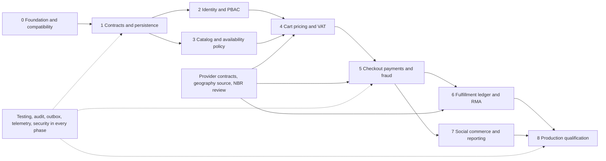

# Section 3: Phased Implementation Roadmap

This is the execution companion to the [enterprise architecture](ecommerce-blueprint.md) and [relational schema](ecommerce-schema.sql). The paths below are proposed implementation destinations unless the baseline table explicitly identifies an existing file. This deliverable does not install dependencies, apply migrations, provision infrastructure, or enable integrations.

## Baseline and implementation rules

The repository inspected for this plan is an existing working monorepo, not an empty scaffold:

| Evidence                                                    | Current state                                                                                                                                                                      | Required treatment                                                                                                                                                                                          |
| ----------------------------------------------------------- | ---------------------------------------------------------------------------------------------------------------------------------------------------------------------------------- | ----------------------------------------------------------------------------------------------------------------------------------------------------------------------------------------------------------- |
| Root `package.json`, `pnpm-workspace.yaml`                  | Workspace `aaraj`; `pnpm@12.5.1`; Node `>=24.15.0 <25`                                                                                                                             | Preserve topology and lockfile; use the workspace package names below.                                                                                                                                      |
| Execution environment                                       | Node `v24.19.0`, pnpm `12.5.1` observed during blueprint preparation                                                                                                               | Recheck on the implementation machine; an environment observation is not a promise about CI or production.                                                                                                  |
| `apps/api/package.json`                                     | Nest packages declared `^12.0.1`; pure ESM; Vitest and Oxlint                                                                                                                      | Verify installed and locked versions, including peers, before adding framework extensions.                                                                                                                  |
| `apps/api/tsconfig.build.json`                              | Production `rootDir` is `src`; compiled entry exists at `apps/api/dist/main.js`                                                                                                    | Keep `start` / `start:prod` semantics. Do not use `dist/src/main.js`.                                                                                                                                       |
| `apps/api/src/main.ts`, `configure-app.ts`, `app.module.ts` | Existing bootstrap, `/api` prefix, Nest URI versioning for REST controllers under `/api/v1`, CORS and health/status routes                                                         | Keep the REST version centralized in shared contracts; keep health version-neutral and Better Auth on its own unversioned `/api/auth` path. Modify incrementally.                                           |
| `apps/web/package.json`                                     | Next.js storefront with a Playwright browser E2E script                                                                                                                            | Follow `apps/web/AGENTS.md` before frontend edits. Retain Next.js unless a separate architecture decision justifies migration.                                                                              |
| `packages/contracts/src/index.ts`                           | Existing health, money, product and order-status schemas and tests                                                                                                                 | Preserve exports; distinguish REST route versions from event schema versions and package versions. Expand tests before changing contract semantics.                                                         |
| API and storefront foundation                               | PostgreSQL/`pg`/Drizzle, Redis, Better Auth email/password, Nest PBAC, audit storage/review, public/staff catalog, and staff-managed on-hand inventory adjustments are implemented | Extend the existing modules and migrations. Do not recreate infrastructure or apply the proposed full schema.                                                                                               |
| `.github/workflows/ci.yml`                                  | Frozen install, shared build, typecheck, lint, tests, API E2E and production build already exist                                                                                   | Extend this workflow. Do not replace working gates with a generic pipeline.                                                                                                                                 |
| `docs/backend/`                                             | Internal reference suite with examples                                                                                                                                             | Follow the standards; validate code examples against the lockfile. The Docker chapter's root `tsconfig.json` and `dist/src/main.js` do not match this repository's `tsconfig.base.json` and `dist/main.js`. |

Choose **PostgreSQL + `pg` + `drizzle-orm`** behind explicit Nest injection tokens. Domain repositories own their SQL and schema imports. Use reviewed, ordered SQL migrations for constraints, functions, privileges and concurrent indexes; add partitioning only for tables whose measured workload and retention needs justify it. A Drizzle schema describes the tables for typed queries; it does not authorize automatic production schema synchronization. The optional `@nestjs/drizzle` integration, and any outbox package, require a successful version/peer/ESM spike before adoption; retain the outbox semantics even if a local adapter is needed.

Every new relative TypeScript import ends in `.js`, including tests and public exports. Reuse runtime symbols such as `CATALOG_PORT` with `@Inject(CATALOG_PORT)` for interfaces. Domain entities cannot import Nest, Redis, `pg`, ORM tables or HTTP clients. Shared contracts expose schemas, event envelopes and public DTOs, never repositories or persistence entities. See [ESM conventions](../backend/migration/04-esm-migration-playbook.md), [provider tokens](../backend/fundamentals/01-custom-providers.md), [module boundaries](../backend/overview/04-modules.md) and [Drizzle reference](../backend/data/03-drizzle.md).

The phase titles show the proposed delivery order. The repository currently has Better Auth, PostgreSQL/Drizzle, Redis-backed auth rate limits, PBAC, append-only audit storage, a minimal catalog, and staff-managed on-hand inventory adjustments. It has no transactional outbox/inbox, cart, checkout, order, payment, warehouse, or courier implementation. Later phases are targets, not statements that these capabilities already exist.

## Planning assumptions, dependencies and ownership

Planning envelope: two backend engineers, one frontend engineer, one platform/SRE engineer, a QA engineer, and part-time security, product/operations and Bangladesh finance/tax specialists. The former **24–36 calendar week** range is illustrative only, not a delivery estimate or capacity commitment; scope, staffing, provider onboarding, signed courier contracts, gateway access, verified geographic data and tax approval can materially change it. Estimate each vertical slice with the actual team and re-estimate after Phase 1 and the first sandbox payment.

Assign named people to these roles in `docs/delivery/owners.md`: architecture lead (**ARCH**), platform/SRE (**PLAT**), backend/domain engineers (**BE**), storefront/admin engineers (**FE**), quality engineering (**QA**), security (**SEC**), commerce operations (**OPS**), finance/tax (**FIN**), and product (**PM**). Each exit gate has one accountable owner even when several teams implement it.

### Capacity baseline before scale claims

Capacity planning must distinguish persisted data volume from request rate and concurrent work; a monthly volume figure alone does not describe system load. Before committing to a production SLO or infrastructure size, record the measured workload or an explicitly identified forecast: per-entity growth and peak rates (products, variants, orders, order lines, audit events), read/write mix, hot-key skew, retention, response sizes, concurrency, and business-approved latency/availability objectives. Use representative seeded data and burst/load scenarios; capture query plans with [`EXPLAIN`](https://www.postgresql.org/docs/current/using-explain.html), p50/p95/p99 latency, error rate, PostgreSQL CPU/I/O/locks and pool waits, Redis latency, and queue age when a queue exists. Current admin product and size-guide searches use substring `ILIKE` patterns across related data; inspect their plans at representative sizes, and consider [`pg_trgm`](https://www.postgresql.org/docs/current/pgtrgm.html) indexes only if those measured queries are a bottleneck. Budget all application connections against PostgreSQL's configured [`max_connections`](https://www.postgresql.org/docs/current/runtime-config-connection.html). Tune other indexes, caches, poolers, replicas, and partitioning from evidence too. Local Compose validates development behavior, not production capacity or failover.

Capture a preliminary workload forecast and current catalog baseline as parallel planning work; neither blocks the bounded API-versioning change or domain development. Refresh the measurements with representative end-to-end load before choosing production capacity or claiming an SLO.



Identity and catalog implementation can proceed in parallel once contracts and ownership are accepted. Phase 7 consent and analytics design may begin earlier, but it must not emit a purchase before the authoritative business transition. Provider adapter spikes and tax discovery should start in Phase 0 while product work proceeds independently.

## Phase 0 — Infrastructure, Secrets & Security Foundation

**Planning range:** 1–2 weeks. **Accountable:** PLAT. **Prerequisites:** repository access and environment owner; implementation approval is separate from this documentation deliverable.

Ordered backlog:

1. Record `docs/decisions/0001-modular-monolith.md`, `0002-money-idempotency-events.md`, `0003-database-and-migrations.md`, `0004-infrastructure-and-secrets.md`, and `0005-dependency-compatibility.md`. Treat AWS (ECS/Fargate, ALB, RDS, managed Redis, object storage/CDN, Secrets Manager/KMS) as one reference option; select hosting from team operations, region, availability, data, and cost requirements, and record the decision. Record ownership of the implemented domains; forbid cross-context repository/table imports and runtime cross-context SQL joins. Use `/api/v1` for REST routes; keep compatible changes in v1 and require a separately supported route version for breaking changes. Version event schemas independently when events are introduced, and define deprecation from actual consumers and releases.
2. Reproduce the existing CI checks with the locked Node/pnpm toolchain. Record installed versions and smoke-test NodeNext import behavior, `StandardSchemaValidationPipe`, and each proposed Nest add-on before accepting it. Inspect registry metadata, license, advisory status, package integrity and peer ranges for the exact selected versions. Do not run unversioned bulk `add` commands from documentation examples.
3. Local PostgreSQL/Redis Compose templates and health checks are implemented under `infrastructure/local/`. Keep this stack development-only; it is not production infrastructure.
4. Build `apps/api/src/platform/config/config.schema.ts`, `config.module.ts`, and `secrets/secrets.port.ts`; add validated `ConfigModule` wiring to the existing `app.module.ts`. Fail startup on missing secrets, malformed URLs, unsafe production CORS, invalid ports, or contradictory feature flags. Never log resolved configuration. `.env.example` contains names and development-only values; staging/production resolve short-lived credentials through workload identity and Secrets Manager or Vault.
5. Build `apps/api/src/platform/http/{correlation.middleware.ts,http-exception.filter.ts,request-limits.ts}`, `platform/security/{security.module.ts,redaction.ts}`, and the first redaction tests. Add strict origin allowlists, Helmet, HTTPS/HSTS at the edge, body/URL/header size limits, a restrictive query parser, raw-body limits for signed webhooks, and explicitly trusted proxy ranges. Bind DI-dependent global guards/pipes/filters/interceptors through `APP_*` providers. Do not trust arbitrary `X-Forwarded-For` or arbitrary correlation IDs.
6. Establish Redis-backed rate policies: browsing **120/min**, authentication **5/min**, checkout/payments **10/min**; key authenticated routes by principal and anonymous traffic by trusted IP/session plus device limits. Define failure behavior: authentication and money mutations fail closed when enforcement is unavailable; cached public catalog reads can degrade under edge limits. Test deployment across multiple API replicas.
7. Once a hosting platform is selected, create only the infrastructure-as-code modules and environments it needs. Specify encrypted private networking, TLS, least-privilege service identities, log retention, backup/recovery, and encrypted remote state with locking. Choose availability topology against the approved SLO; separate state and credentials by environment and enforce reviewed plan/apply roles.
8. Establish a PostgreSQL connection budget across API replicas, workers, migrations, and emergency reserve. Use a pooler such as PgBouncer only if the topology and connection budget require it; if selected, verify its pooling mode and prepared-statement behavior with the deployed driver. Keep migrations and long maintenance operations on an explicitly managed connection path.
9. Extend `.github/workflows/ci.yml` with secret scanning, dependency/license/SBOM checks and a database-backed integration job only after its config exists. Create `docs/runbooks/{local-development,secret-rotation,incident-triage}.md`. Add budget alerts for SMS, object storage and external gateway requests before enabling providers.

**Exit gate:** PLAT and SEC accept a reproducible clean checkout; separate environment boundaries; a demonstrated secret rotation; rejected unsafe configuration; cross-instance throttling; masked synthetic PII in logs/spans/errors; and baseline CI evidence. No internet-facing mutating commerce endpoint is enabled yet. A production-like staging environment must exercise the selected availability and recovery design before launch; PgBouncer is not a prerequisite when the measured connection budget does not need it.

References: [configuration](../backend/application/01-configuration.md), [security headers](../backend/security/04-security-headers.md), [rate limiting](../backend/security/07-rate-limiting.md), [deployment health checks](../backend/deployment/04-health-checks-terminus.md).

## Phase 1 — Domain Contracts & Persistence (partial)

**Planning range:** 2–3 weeks. **Accountable:** ARCH. **Prerequisites:** Phase 0 security baseline and compatibility decision.

Ordered backlog:

1. Add contract modules under `packages/contracts/src/` alongside each implemented domain slice; do not pre-create empty directories for all proposed domains. Preserve existing `index.ts` exports until clients migrate. Version money, address, pagination, problem details, event envelopes and state-transition inputs as they are needed. Enforce strict objects, bounded strings/arrays, prohibited keys, safe integer JSON amounts, known currency codes and UTC timestamps. Use `bigint` internally for monetary arithmetic; validate safe integer bounds when serializing a JSON number.
2. Implemented foundation: `pg`/Drizzle pool, shutdown, and the checked-in migration runner. Production TLS and separate migration credentials are now explicit. Add statement/lock/idle-transaction timeouts and restricted runtime grants when production deployment requirements are defined; do not add primary/replica machinery before a replica exists.
3. The Drizzle migration journal and current migrations are already established under `apps/api/drizzle/`. Continue with reviewed, incremental owner migrations; do not add the retired `apps/api/migrations/0000_bootstrap.sql`, import a second journal, or apply the proposed full schema to an existing database.
4. Create immutable geographic dataset metadata and `geography.divisions`, `districts`, `upazilas`, `areas`, and provider zone mappings. Implement `apps/api/src/modules/geography/{domain,application,infrastructure,ingress}/` plus `public.ts`. Record source/license/version, distinguish thana/upazila and area/union types, validate parent-child links, retain renamed/historical entries and map courier zone identifiers by provider and dataset version. Do not assume courier zones are universal geographic IDs. Seed only reviewed source data, never invented complete Bangladesh coverage.
5. For each command that can be retried and would otherwise create a duplicate business effect, define a stable business uniqueness rule and persist its idempotency receipt/result in the same owner transaction. Prioritize payment, order placement, inventory reservation, and other irreversible or scarce-resource operations. Add a client `Idempotency-Key` where it is part of that command's API contract; do not require a generic key on every simple mutation. Redis may accelerate response replay or admission, but must not be the sole duplicate-prevention record.
6. Introduce owner-scoped outbox/inbox storage with the first workflow that requires durable asynchronous delivery or cross-context event publication. Verify provider webhook signatures and deduplicate provider events using their stable event/transaction identity. Keep event payloads versioned, minimal, and free of unnecessary PII.
7. For that first outbox workflow, implement a focused relay/consumer slice: commit the event with owner state, claim work with bounded leases, dispatch at least once, and deduplicate consumer effects. Add retry/DLQ handling and queue-age alerts when an actual worker/queue is introduced. An in-process emitter may notify local code after commit but is not durable delivery.
8. Implemented in part: business role/catalog writes append audit events in their transaction; auth outcomes and authorization denials are recorded without credentials or email addresses; superadmins can review bounded pages; SQL triggers reject UPDATE/DELETE/TRUNCATE. Production still needs a restricted runtime role, approved retention, and any stronger separately administered archive the business requires. A database superuser can disable a table trigger.
9. Start with ordinary tables and indexes. For each high-growth table, consider partitioning only after representative query plans, expected table size, access patterns, and retention/deletion requirements show a benefit. If adopted, test partition-key uniqueness/foreign-key constraints, retention boundaries, late arrivals, and partition availability before rollout. Establish expanding migrations, backfill checkpoints and role grants per owner.

**Exit gate:** ARCH accepts a reviewed ownership graph and import-boundary CI rule; database constraints reject inconsistent money/address/stock data; migration checksums and repeat execution work; each implemented retryable command has durable duplicate protection; an administrative mutation has attributable, redacted audit evidence. If this phase implements an outbox workflow, prove that a worker crash after commit loses no event and duplicate delivery changes business state once. Geography has a source/version and complete parent integrity for the initial service area.

References: [validation](../backend/application/02-validation.md), [idempotency](../backend/reliability/02-idempotency-keys.md), [outbox](../backend/reliability/03-transactional-outbox.md), [events](../backend/application/05-events.md). Interpret any reference claims of “exactly once” as application-level effects under these persisted deduplication rules, not an end-to-end network guarantee.

## Phase 2 — Better Auth Email/Password & Access Control (foundation implemented)

**Planning range:** 2–3 weeks, partly parallel with Phase 3. **Accountable:** SEC, implementation BE/FE. **Prerequisites:** Phase 1 persistence and the identity requirements in [the authentication plan](ecommerce-authentication.md).

Ordered backlog:

1. Implemented: Better Auth email/password in `apps/api/src/auth/`, PostgreSQL Drizzle adapter, and the documented Nest adapter. Email verification remains disabled at launch.
2. Implemented: reviewed identity migrations, required auth secret and production URLs, trusted origin, adapter body parsing, and public health routes. Keep schema changes in reviewed Drizzle migrations.
3. Implemented: NestJS's official `@nestjs/authorization` module runs after Better Auth. The PBAC base has the exact roles `superadmin`, `admin`, `staff`, `moderator`, and `customer`, explicit access/audit/catalog permissions, persisted elevated assignments, `/api/v1/access/*` and `/api/v1/audit/events` policies, and a first-superadmin operator command. Follow [the authorization guide](../backend/security/02-authorization.md). Extend the shared permission registry and role bundles alongside real commerce workflows. Authorize each protected operation at the appropriate boundary: use `@Can()` for a handler-level capability or `AuthorizationService.authorize()` in the owning service when service reuse or operation context requires it. Keep record ownership, state, and transaction-dependent checks in the service. Use both only for distinct checks; do not repeat the same ability check.
4. Role changes now require a trusted Origin, a sign-in within 15 minutes, transactional reauthorization, and an audit event in the same transaction. Concurrent revocations preserve the last superadmin. Establish the corresponding step-up and audit requirements before enabling refund, price-override, and inventory-adjustment writes.
5. Implemented: the initial customer session UI uses Better Auth email/password with no verification or OTP step. Extend it only for concrete customer workflows.

**Exit gate:** email/password sign-up and sign-in pass duplicate-email, generic-error, rate-limit, session-revocation, cookie/CSRF, and protected-route tests. Every privileged write has an explicit authorization rule. Do not expose auth-backed mutations until these checks pass.

References: [authentication plan](ecommerce-authentication.md), [NestJS authentication](../backend/security/01-authentication.md), [authorization](../backend/security/02-authorization.md), [encryption/hashing](../backend/security/03-encryption-hashing.md), [CSRF](../backend/security/06-csrf-protection.md).

## Phase 3 — Catalog and Availability Policy

**Planning range:** 3–4 weeks. **Accountable:** BE catalog owner, with OPS input on availability policy. **Prerequisites:** Phase 1; Phase 2 gates administrative publishing.

Ordered backlog:

1. The minimal `apps/api/src/catalog/` module, product contract, `catalog.product` table, public published-only browse routes, staff/admin writes, and same-transaction audit events are implemented. The launch catalog stores each variant's current base price as a non-negative whole-BDT integer (`amountBdt`) in PostgreSQL `integer`; fractional BDT amounts are rejected, and `0` is an explicit free price distinct from an unset draft price. Draft variants may remain unpriced, but publishing requires a price for every active variant. Public responses expose one product price derived from the first active variant in color order and the assigned size guide's order; public variant options expose colors and sizes without their individual prices. Staff can still manage each variant's current price, and edits are recorded in the existing product audit transaction. The approved inventory policy uses one shared stock pool per sellable variant; no location model is needed for launch. Extend this clothing catalog with one product per style and one sellable variant per real color/size combination, each with a unique SKU. Keep audience (`men`, `women`, or `unisex`), category, fit, fabric composition, and care instructions on the product; keep color, product-specific size label, optional variant media, and an optional officially assigned GTIN on the variant. Enforce unique SKU and unique product/color/size combinations. A `One Size` garment is an explicit size label. Keep product media ordered. Preserve Aaraj's audience labels in the catalog and map them to any channel-specific vocabulary only at that channel's export boundary ([Google Merchant Center example](https://support.google.com/merchants/answer/7052112?hl=en)).
2. Keep size guides as reusable, typed records within the catalog, referenced by one size-based product. The product editor selects a matching existing guide or creates one for a new sizing block; reuse a guide only when its garment type, measurement basis, labels, and grading genuinely match. Validate that every size variant has a corresponding guide row before publishing. Accept measurements in either centimetres or inches, normalize to one canonical `numeric(8,2)` millimetre value, and derive both display units rounded to one decimal place. Label measurements as garment or body measurements; do not store independently editable conversions or binary floating-point values. The inch is exactly 25.4 mm ([NIST](https://www.nist.gov/pml/owm/si-units-length)). In the storefront, show the assigned guide beside the size selector and display both units ([Baymard apparel guidance](https://baymard.com/research-articles/apparel-5-best-practices)). A reusable product reference is a well-established commerce pattern ([Shopify metaobject references](https://help.shopify.com/en/manual/custom-data/metaobjects/referencing-metaobjects)).
3. Implemented: categories are reusable `catalog.category` records with stable IDs, unique lowercase slugs, an optional parent and display order. The category manager belongs to the existing Catalog module and has its own admin/superadmin permission; product and size-guide forms select from that same managed tree. Assign each product style one active leaf category for launch, keep audience (`men`, `women`, or `unisex`) as a separate product field, and filter parent categories through their descendants. Prevent deactivation while a category has active children or product/size-guide references; do not hard-delete categories. Use collections later for overlapping campaigns and merchandising. Add search/facet indexes only for measured query needs; consider `pg_trgm` if measured plans show it would improve substring search or if typo matching becomes an approved requirement. Do not add a generic JSONB attribute store in advance.
4. **Launch availability decision recorded:** products are stock-managed per sellable variant, all variants share one stock pool, locations/warehouses are out of launch scope, and checkout must not oversell. Reservation expiry remains intentionally undecided until checkout and payment behavior is designed. This is a business policy, not a framework default.
5. The inventory foundation adds PostgreSQL on-hand balances, a durable movement record, and authorized, reasoned, idempotent staff adjustments. The next stock slice belongs with checkout: add one reserved quantity per variant, durable reservation groups/items, and guarded hold/allocate/release/dispatch transitions. Reserve a cart's aggregated variant quantities atomically in one Inventory transaction, in stable variant-ID order; if any line is unavailable, roll back the whole reservation. Keep location, quarantine, and extra approval models out of launch scope. Follow the detailed state and concurrency design in [the blueprint's Inventory section](ecommerce-blueprint.md#07-inventory-and-reservation-safety). Redis does not authorize stock consumption. Add scaling mechanisms only when measured demand requires them.
6. **Implemented; data-scale qualification remains:** buyer-facing Catalog search covers product name, description, fit, fabric composition, and care instructions, with the shared 160-character bound and existing result/page limits. It uses literal Unicode substring matching; it does not imply transliteration, typo correction, aliases, or relevance ranking. Search composes with published-product eligibility and existing filters before pagination, and malformed query parameters do not fall back to an unfiltered listing. API and browser E2E cover supported text fields, Unicode, SQL pattern wildcards, validation bounds, filter composition, and paginated results. Before Phase 3 exit, inspect query plans with representative data; add an index, projection, or dedicated engine only if measured query cost or search-quality requirements justify it.
7. Implement `modules/catalog/infrastructure/media/` signed upload initiation, MIME/content validation, byte/pixel limits, malware scanning where relevant, private originals, transformation jobs and AVIF/WebP/responsive derivatives. Use immutable content/version URLs for CDN invalidation; set explicit cache controls. Isolate untrusted image parsing from API workers.
8. Add cache singleflight with bounded waits, jittered TTL, stale-while-revalidate policy and stale-size limits. Implement storefront list/search/product detail pages, accessible filters, image dimensions, fallback text and versioned OpenGraph cards. CMS content cannot override authoritative price or availability.

**Exit gate:** QA demonstrates that negative or overflowing balances are rejected under concurrent staff adjustments, a repeated command ID cannot apply a second movement, and each successful adjustment has authorization, a reason, a movement record, and an audit event in the same transaction. The full no-oversell gate—contending reservations, timeout/retry, and process failure—belongs to checkout qualification after reservation lifecycle is defined. If Redis admission is implemented, include Redis restart/loss recovery. Catalog query plans and image limits are reviewed; cache behavior is qualified only for caches introduced by the slice, and a stale product view cannot bypass checkout revalidation.

## Phase 4 — Cart, Pricing & NBR Tax Compliance

**Planning range:** 3–4 weeks. **Accountable:** commerce BE, with FIN accountable for tax rules. **Prerequisites:** identity, catalog, and an approved product-availability policy; an Inventory port is needed only for stock-managed checkout.

Ordered backlog:

1. Implement `modules/cart/` signed anonymous cart handles with a **7-day TTL**, durable customer carts, schema/versioned cart contents, maximum lines/quantities and deterministic login merging. Set a one-time durable merge command receipt; merge simultaneous guest/login requests without duplicating quantities. Cart lines reference catalog IDs and display snapshots, while checkout recalculates authority.
2. Defer a separate pricing module until cart/checkout needs price books, promotions, or tax calculations. Any future quote must consume the catalog's whole-BDT base price without changing the product editor/API contract. Design monetary rounding, discount/tax allocation, provider formats, and refund rules with Finance and provider documentation before implementation; do not assume the catalog price is fractional currency.
3. Keep launch pricing limited to approved catalog prices, required tax, and checkout quotes. Defer flash sales, bundles, coupon quotas, anti-stacking, and other promotion rules until Product and Finance approve concrete launch requirements; a cart preview never reserves stock or guarantees a promotion.
4. Build geographic delivery quotations using the four-level address hierarchy and verified provider serviceability mappings. Support locality text/instructions safely, validate phone/address fields and show explicit out-of-stock/repricing notices. Require reconfirmation for material price changes; do not silently charge a newer quote.
5. Add versioned, effective-dated VAT rules, merchant/BIN settings, exempt/rate classifications, taxable base and adjustment records. Draft Mushak 6.3 renderer/export in `modules/pricing/application/invoicing/` against the official form and the merchant's approved treatment. FIN signs off invoice fields, sequencing, rounding, translations and correction/refund workflow before any claim of compliance. No hardcoded universal Bangladesh VAT rate.
6. Add unit/property-style tests for largest-remainder allocation, caps, currency mismatch, integer overflow, cancellation/refund reversals and quote expiration. Configure **100% statements, branches, functions and lines for money and state-transition algorithm files**, with no unexplained ignored branches. Integration tests remain necessary even at 100% coverage.

**Exit gate:** FIN approves representative tax/invoice cases and the effective-date/version process. QA proves conservation of subunits across discounts, tax, settlement and partial refunds; coupon quotas withstand concurrency; login merging is idempotent; checkout sees current prices and serviceable addresses. A versioned quote can be reproduced from its recorded inputs.

## Phase 5 — Checkout State Machine, MFS Payments & COD Risk

**Planning range:** 4–6 weeks, subject to provider onboarding. **Accountable:** order/payment BE; FIN owns settlement acceptance. **Prerequisites:** pricing snapshot, approved availability policy (and inventory reservations only for stock-managed products), identity, audit/outbox and first provider sandbox.

Ordered backlog:

1. Implement `modules/order/domain/` explicit transition tables, separate payment/fulfillment state, order acceptance rules, quote expiry and cancellation/compensation. Build checkout as a persisted process manager using owner-module commands and events. Persist its progress before crossing module/provider boundaries; reserve the entire validated cart through Inventory before starting payment. Do not read/write other modules' tables or hold database locks across provider HTTP calls.
2. Apply the retry-safe command contract to order placement, payment/refund attempts, inventory reservations, and any other operation where retry could duplicate a material effect. A reused key with changed payload fails; an in-progress operation has a stable retry/status response; a completed command replays its safe durable result. Redis expiry or outage cannot authorize a duplicate payment. Enforce provider and business uniqueness independently of a client key.
3. Implement `modules/payment/application/payment-provider.port.ts` and `infrastructure/providers/{bkash,nagad,sslcommerz,aamarpay}/`. Each adapter uses Node native `fetch` or a verified maintained HTTP client, explicit request/response schemas, abort deadlines, token caching, bounded retries and a circuit breaker/bulkhead. Do not install unmaintained CommonJS gateway wrappers. Implement only provider-confirmed signing/encryption/authentication procedures from merchant documentation; never invent a shared “HMAC webhook” protocol.
4. Treat browser return URLs as navigation only. Authenticate and persist webhook receipts before acknowledging; verify merchant account, currency, amount and provider transaction identity through the provider's supported verification/query API. Handle duplicate, delayed, missing, out-of-order and contradictory callbacks; persist an `UNKNOWN`/pending outcome on network ambiguity and reconcile before any new charge or stock release. At reservation expiry, use the selected provider's documented cancel/status behavior; define the response to a late verified capture before launch.
5. Schedule two reconciliation paths: transaction status for unresolved attempts and financial settlement/report reconciliation. Lock work claims, keep stable operation IDs, and store redacted evidence and discrepancy queues. An HTTP timeout is not proof that a provider action failed.
6. Implement `modules/order/application/cod-risk/` transparent risk rules using historical RTS, first-order status, velocity and approved signals. Configure the requested courier advance as **10,000–15,000 BDT subunits (৳100–৳150)**, subject to quotation/merchant policy. Explain the advance before payment. Deduct a captured advance from delivery collectable; record treatment on cancellation, delivery failure and refund. Never collect the full COD amount after taking an advance.
7. Quarantine suspect orders with `FLAGGED_FOR_REVIEW`, reason codes, restricted evidence and review deadlines. Expose approve/reject/ask-for-confirmation actions only to staff with the workflow's explicit permission; define its role grants and any step-up requirement when implementing that workflow. Audit decisions and notify customers. Avoid opaque automatic punishment based on unvalidated proxies; record rule versions and reviewer overrides.
8. Finish the mobile checkout UI with persisted idempotency keys, resumable pending payment, clear paid/pending/advance-required states, network retry guidance and accessibility. Keep payment credentials and tokens out of client URLs, analytics and support screenshots.

**Exit gate:** QA proves that concurrent checkouts for the final unit cannot both reserve it; multi-variant reservation is all-or-nothing; repeated commands and callbacks cannot double-reserve, release, or consume stock; and expiry, cancellation, payment confirmation, dispatch, process restart, and provider ambiguity resolve without negative availability or untracked payment. QA and FIN also demonstrate prepaid, COD, payment timeout, late capture after cancellation, refund, and manual-review journeys. Each produces one authoritative business effect and explainable audit. A provider outage does not exhaust API or worker concurrency. Merchant sandbox certification and credential custody are signed off before real payments.

References: [HTTP adapters](../backend/application/08-http-client.md), [raw-body verification](../backend/faq/05-raw-body.md), [resilience](../backend/reliability/01-resilience.md).

## Phase 6 — Fulfillment and Courier Operations (future)

**Planning range:** 4–5 weeks. **Accountable:** fulfillment BE and OPS; FIN owns reconciliation rules. **Prerequisites:** stable order/payment events and provider-approved logistics accounts.

Ordered backlog:

1. Introduce durable outbox/inbox delivery when the first asynchronous business workflow needs it, then use it for packing, courier booking, tracking, settlement, and returns. Multiple-warehouse allocation is explicitly outside the initial launch scope.
2. Implement allocation policy over Inventory's public availability/reservation commands: serviceability, stock, dispatch cutoff, shipping cost and operational priority. Record deterministic decisions and reservation IDs; produce shipment-level allocations and independent tracking, while the parent order retains its original financial identity. Split taxes, discounts, delivery fees and COD collectable by recorded subunit allocations.
3. Implement `modules/fulfillment/infrastructure/couriers/{pathao,steadfast,redx}/` typed adapters. Use official zone mappings, stable merchant references and verified label formats; record unknown booking outcomes and query before retrying. Do not assume the courier supports an idempotency header. Deduplicate tracking events and map provider status codes through a versioned table without losing the raw normalized code.
4. Add label generation, packaging/weight rules, handover manifests, pickup cancellation, partial delivery and RTS transitions. Use signed webhook validation where available and bounded BullMQ polling for missed updates. Track source timestamp, received timestamp and monotonic shipment version; late “in transit” must not undo delivered/returned final state.
5. Implement `modules/courier-ledger/` double-entry control accounts, courier receivables, COD commissions, delivery/return fees, advance offsets, remittances, settlement batches, adjustments and exceptions. **1% is a configurable contract example**, not a universal commission. Validate unique report lines and report hashes; match by provider/consignment/reference, currency and amount. Do not mark an order remitted merely because delivery was confirmed.
6. Implement `modules/fulfillment/application/rma/` eligibility, partial quantities, doorstep refusal/RTS, inspection grades, restock/dispose, permitted fees and refund authorization. Reuse the original line allocations and cap total returned/refunded quantities and money. A return receipt alone does not restore saleable stock; inspection acceptance does. Prevent concurrent duplicate refunds using both durable commands and ledger constraints.
7. Expand `modules/notification/` queue adapters for transactional SMS, WhatsApp and email, with per-channel templates, retry classification, bounded exponential backoff/jitter, DLQs and provider receipts. Apply circuit breakers and spend budgets per channel. Notifications must not block order commit.

**Exit gate:** OPS proves a Dhaka/Chattogram split shipment, courier booking ambiguity, missed webhook recovered by polling, RTS, partial delivery and graded return. FIN signs balanced ledgers, repeated statement imports without duplicates, advance deduction, fee/commission allocation and a real sandbox discrepancy investigation. QA proves an outbox/queue worker can crash and replay each workflow safely.

Reference: [queues](../backend/application/07-queues.md), [distributed locks](../backend/reliability/04-distributed-locks.md).

## Phase 7 — CAPI Tracking, Audit Logging & Social Commerce

**Planning range:** 2–3 weeks, partly parallel with later Phase 6. **Accountable:** FE/BE customer-experience owner; SEC/OPS review. **Prerequisites:** authoritative purchase/shipping transitions, permission matrix and consent model.

Ordered backlog:

1. Implement `modules/notification/application/analytics/` with purpose-specific consent, an allowlisted event schema, retention, server-side Meta CAPI and GA4 adapters, stable event IDs and browser/server deduplication. Emit purchase once at the documented commercial milestone and corrections/refunds with distinct IDs. Separate consented tracking from operational order processing. Hashing contact details does not remove their sensitivity; never place them in ordinary telemetry.
2. Build `modules/notification/ingress/social/` WhatsApp Business and Messenger verified webhook ingestion, durable provider inboxes, identity linking with user confirmation and channel state. Social orders invoke the same cart/quote/checkout commands, permissions and risk rules as storefront orders. A sender ID is not proof of ownership of an existing customer account. Support template/session constraints and opt-out rules from the selected provider's current documentation.
3. Extend the current bounded audit review only when operators need additional filters or export. Any export must have a separate permission and its own audit event; do not add unredacted snapshots. Retention and stronger archive requirements remain production decisions.
4. Implement `modules/moderation/` reviews, profanity/spam screening, report/appeal workflow and authorized publication changes. Build back-office cursor pagination and constrained bulk commands with preview, per-item results, independent idempotency and audit.
5. Implement `modules/support/` CRM read projections from public events: orders, payments, shipping, communication and ticket references. Expose manual address correction only before dispatch and through the order/fulfillment public workflow; invalidate/requote zone/fees and update pending consignments as required. Record the customer request and exact change.
6. Add time-boxed support impersonation with explicit reason, original operator identity, visible UI banner, least privilege and termination. Prohibit payment credential access, MFA changes, privilege assignment and sensitive financial actions under impersonation. Enable security review and customer-facing notification according to approved policy.
7. Add DLQ monitoring/triage UI and alert routing to configured PagerDuty/Slack/Discord endpoints. Replays require permission, reason, preview and stable original event identity; preserve the replay audit. Document a queue's retry versus quarantine decision, alert severity, on-call owner and maximum age.

**Exit gate:** PM/SEC approve consent behavior, browser/server deduplication and social identity linking. OPS can investigate one customer timeline without exposing credentials, payment data, or full addresses; bulk actions and impersonation produce attributable audit. Failed jobs page the configured on-call test sink and can be replayed without duplicated financial effects.

## Phase 8 — Production Hardening, Disaster Recovery & Automated Testing

**Planning range:** 3–5 weeks; foundational work begins in Phase 0. **Accountable:** PLAT release owner. **Prerequisites:** Phase 5–7 business acceptance and signed provider/finance/security decisions.

Ordered backlog:

1. Extend `.github/workflows/ci.yml` with real PostgreSQL/Redis integration tests, an API/web contract compatibility gate, algorithm coverage enforcement, image/SBOM scanning, verified build provenance and immutable artifact promotion. Add `apps/api/vitest.config.integration.ts` and `test:integration` only when the integration suite exists; do not assume they exist today. Keep API `test`, `test:e2e` and `test:cov` scripts and the existing unit/E2E filename split. Add frontend E2E tooling through a reviewed dependency change.
2. Create `apps/api/test/{checkout,inventory-concurrency,payment-reconciliation,refund-rma,outbox-crash,migration-compatibility,pii-redaction}.e2e-spec.ts` or appropriately isolated integration files. Extend Vitest includes/excludes so real-service tests do not silently run against mocks or run twice. Set 100% coverage on the financial/state algorithm scope explicitly; use risk-based coverage elsewhere.
3. Build `tests/load/` scenarios for catalog browsing, flash-sale contention, authentication abuse, checkout and webhook bursts. Establish a measured workload model and obtain product/operations approval for SLO targets before treating them as release gates. Existing latency/availability numbers are candidates for review, not commitments. Measure p50/p95/p99, error rate, DB lock wait and pool saturation; measure replica lag, outbox age, queue age, and provider errors when those components exist.
4. Validate all outbound adapters' deadlines, retry safety, jitter, bulkheads, circuit-breaker recovery and graceful degradation under latency, DNS errors, 429s, inconsistent payloads and outage. Cached catalog can serve stale content within policy; checkout cannot invent available stock or payment success. Alert on reconciliation backlog and ambiguous payments independently of HTTP uptime.
5. Build `apps/api/Dockerfile`, `apps/web/Dockerfile` and `.dockerignore` against actual workspace output. Copy `tsconfig.base.json`, build `@aaraj/contracts` first, retain runtime workspace exports and validate `node apps/api/dist/main.js`. Use a digest-pinned Node 24 image, non-root user, init/signal handling, read-only filesystem where supported and no embedded secrets. Test the final image, not just the builder stage.
6. Separate API and worker process entrypoints, with independent autoscaling and concurrency/pool budgets. Add readiness for critical dependencies, liveness that does not restart every instance on a shared database outage, startup probes, graceful drain, queue lease handling and termination deadlines. Keep expensive provider checks out of liveness probes.
7. Agree the required recovery point (RPO) and recovery time (RTO) with product and operations. Configure encrypted backups/PITR and WAL archiving to meet those targets, then restore at realistic data volume and record the result; a successful backup upload alone is not recovery evidence.
8. Create runbooks for the recovery scenarios required by the approved RPO/RTO, including database restore, failover, read-only mode, payment reconciliation, and migration recovery. Add regional recovery only if the business recovery target warrants its cost and operational burden. Fence old writers, promote deliberately, rotate endpoints/credentials and prevent split brain. Rebuild cache/search and reconcile provider-side actions after recovery; do not blindly replay payments from restored snapshots.
9. Rehearse expand-and-contract: additive compatible schema → deploy code that handles old/new → bounded observable backfill → validation → switch readers/writers → wait rollback window → later contract release. Run N and N−1 application versions against the expanded schema. Put concurrent indexes in appropriately nontransactional migration steps. Configure lock timeouts and abort criteria; do not promise instantaneous rollback after destructive schema removal or external side effects.
10. Complete penetration testing, abuse testing, dependency review, provider credential rotation, PII inventory/retention/deletion procedures, tax sign-off, customer policies and operational training. Schedule limited-traffic canary with roll-forward/rollback thresholds, financial reconciliation checkpoints and an assigned incident commander. External launch/deployment is an operational decision after these artifacts are reviewable.

**Exit gate:** PLAT accepts the signed launch evidence below; FIN signs settlement and tax; SEC signs authorization/PII; OPS signs fulfillment/returns/on-call. A known critical money, inventory, authorization, backup or reconciliation defect blocks launch regardless of headline coverage or performance.

### Required test and release evidence

| Layer                   | Concrete evidence                                                                                                                                      | Blocking failure                                                          |
| ----------------------- | ------------------------------------------------------------------------------------------------------------------------------------------------------ | ------------------------------------------------------------------------- |
| Contracts               | Same versioned Zod schema accepts/rejects API and web fixtures; unknown keys, malformed phones, currency mismatch and oversized input rejected         | Divergent client/server behavior or unsafe numerical boundary             |
| Pure algorithms         | 100% measured financial/state algorithm coverage; randomized conservation checks; overflow/rounding edges                                              | Lost subunit, invalid transition, non-reproducible price/refund           |
| PostgreSQL integration  | Actual constraints, row locks, idempotency receipts, inbox and transaction rollback; partition routing if partitioning is adopted                      | Oversell, duplicate effect, orphan financial identity                     |
| Redis integration       | Atomic throttling/Lua, TTL policy, Redis restart/eviction behavior and rebuild                                                                         | Redis loss allows duplicate charge or negative stock                      |
| Provider contract tests | Redacted official sandbox fixtures plus timeouts, malformed bodies, duplicate/out-of-order callbacks                                                   | Browser-return trust, unverified capture, blind retry of ambiguous action |
| E2E/Supertest           | Browse → email/password sign-up and sign-in → cart merge → quote → prepaid/COD/advance → dispatch → return/refund; authorization and CSRF denial cases | Broken purchase funnel or unauthorized mutation                           |
| Event chaos             | Kill before/after commit, before/after enqueue, during consumption; replay both old and new event versions                                             | Lost committed work or unsafe replay                                      |
| Migrations              | Fresh database + upgrade from previous release + N−1 compatibility + backfill restart; partition rollover if used                                      | Unbounded table lock or incompatible rollback window                      |
| Telemetry/security      | Synthetic PII absent from logs/spans/errors; secrets never in artifacts; access checks on tracing/audit exports                                        | Sensitive value leak or absent actor attribution                          |
| Recovery                | Restore/failover scenarios selected by approved recovery objectives; reconcile provider effects at realistic scale                                     | Approved RPO/RTO missed or split-brain/duplicate external action          |
| Operations              | DLQ, queue age, reconciliation discrepancy and SMS-spend alerts reach a test destination; documented acknowledgement                                   | Silent money/queue backlog or absent on-call owner                        |
| Load/release            | Signed load baseline, pool budget, canary rollback evidence and independent artifact verification                                                      | Error-budget breach, exhaustion or unverified production image            |

### Coverage of the 36 requested pillars

The phase shown first introduces the capability; later phases extend or qualify it.

| Pillar                              | Delivery phases                      | Accountable owner / acceptance artifact                                                                           |
| ----------------------------------- | ------------------------------------ | ----------------------------------------------------------------------------------------------------------------- |
| 1. Bounded contexts                 | 0, 1, all                            | ARCH / ownership map and boundary test                                                                            |
| 2. PostgreSQL capacity and recovery | 0, 8                                 | PLAT / connection budget and recovery evidence; HA/partitions when required by approved SLO and measured workload |
| 3. PBAC                             | 2, 7                                 | SEC / five-role permission matrix, ownership checks and denial tests                                              |
| 4. Validation/ingress               | 0, 1                                 | SEC / hostile input and contract tests                                                                            |
| 5. Distributed throttling           | 0, 2, 5                              | SEC / multi-instance quota and fail-closed tests                                                                  |
| 6. Secrets/IaC                      | 0, 8                                 | PLAT / reviewed plan and rotation proof                                                                           |
| 7. Concurrency stock                | 5, 6 if stock-managed                | BE / oversell and reconciliation tests                                                                            |
| 8. Search/facets                    | 3                                    | BE / relevance fixtures and explain plans                                                                         |
| 9. Dynamic pricing/flash sales      | 3, 4                                 | BE / concurrency and quote-version tests                                                                          |
| 10. Media/CDN/OG                    | 3                                    | FE / transformation and cache acceptance                                                                          |
| 11. Hybrid cart                     | 4                                    | BE / merge retry and expiry tests                                                                                 |
| 12. Subunit math                    | 1, 4                                 | FIN / integer boundary and conservation proof                                                                     |
| 13. Coupons/discounts               | 4, 5                                 | FIN / quota/stack/allocation fixtures                                                                             |
| 14. Better Auth email/password      | 2                                    | SEC / rate-limit, session, and protected-route tests                                                              |
| 15. COD advance/risk                | 5, 6                                 | OPS / advance-to-COD reconciliation                                                                               |
| 16. MFS/gateway adapters            | 5                                    | FIN / sandbox and dual-reconciliation acceptance                                                                  |
| 17. BD address hierarchy            | 1, 4, 6                              | OPS / sourced geography and courier mapping                                                                       |
| 18. VAT/Mushak 6.3                  | 4, 8                                 | FIN / approved versioned invoice samples                                                                          |
| 19. Conversational commerce         | 7                                    | PM / verified social order journey                                                                                |
| 20. Transactional outbox            | First durable async workflow, then 6 | ARCH / crash and duplicate-consumption tests when implemented                                                     |
| 21. Warehouses/splits               | Later, if required                   | OPS / split allocation and collection totals                                                                      |
| 22. Couriers/polling                | 6                                    | OPS / booking ambiguity and missed-webhook recovery                                                               |
| 23. COD ledger                      | 6                                    | FIN / balanced entries and report reimport                                                                        |
| 24. RMA                             | 6                                    | OPS / graded stock and capped partial refund                                                                      |
| 25. Notifications                   | 1, 2, 6                              | BE / retry, deduplication and delivery receipts                                                                   |
| 26. Fraud/quarantine                | 5, 7                                 | SEC / explainable review/appeal workflow                                                                          |
| 27. Immutable audit                 | 1, 2, 7                              | SEC / access restriction and tamper detection                                                                     |
| 28. Administration/moderation       | 2, 7                                 | OPS / bulk commands and impersonation audit                                                                       |
| 29. Support CRM                     | 7                                    | OPS / authorized timeline and address correction                                                                  |
| 30. Circuit breakers                | 0 policy, 2–7 adapters, 8            | PLAT / provider-outage qualification                                                                              |
| 31. Tracing/flight recording        | 0, all                               | PLAT / correlation propagation and PII absence                                                                    |
| 32. Backups/PITR                    | 0 design, 8 drill                    | PLAT / approved and measured RPO/RTO                                                                              |
| 33. Migration/rollback              | 1, 8                                 | ARCH / N/N−1 expand-and-contract rehearsal                                                                        |
| 34. Automated tests                 | 0, all                               | QA / layered evidence matrix above                                                                                |
| 35. DR/multi-region                 | 0 design, 8 drill                    | PLAT / fenced promotion and maintenance-mode drill                                                                |
| 36. DLQ/alerting                    | 1, 6, 7, 8                           | OPS / acknowledged alert and safe replay                                                                          |

# Section 4: Current local setup and verified baseline

The original Day 1 scaffold checklist is obsolete: the local PostgreSQL/Redis Compose stack, database configuration, migration runner, authentication tables, audit foundation, PBAC tables, and initial catalog migration are already in the repository. Do not recreate the old `apps/api/migrations/0000_bootstrap.sql` or apply the proposed full commerce schema. The checked-in Drizzle migrations in `apps/api/drizzle/` are authoritative.

From the repository root, `pnpm dev` starts the local PostgreSQL/Redis services, builds workspace packages, applies pending Drizzle migrations, then runs the API and storefront together. It preserves existing local data. Use `pnpm dev:infra` to start only the dependencies; API-only or web-only development assumes the infrastructure is already running. The local migration step does not run in production; production migrations use a separate migration role and an explicit deployment step.

Use `pnpm --filter @aaraj/api run test:e2e` for the real PostgreSQL/Redis checks. E2E setup creates a uniquely named disposable database and isolated Redis keys; it does not truncate the developer database. Run `pnpm --filter @aaraj/web exec playwright install chromium` once to install the browser, then `pnpm --filter @aaraj/web test:e2e` for the storefront workflow. The browser suite uses an isolated test API fixture; the API E2E suite separately covers real Nest authorization, persistence, and audit. Routine local stopping can use `pnpm dev:infra:stop`, which retains data.

The current app is a foundation with a working clothing catalog and staff inventory-adjustment slice. The storefront provides public browse, product details, and filters for audience, merchant-managed category, active variant color, and active variant size; unpublished detail URLs return 404. Color and size filters must match the same active variant. Filter choices come only from published products and active variants. `/account` retains email/password sign-in. `/admin/catalog` manages product styles, audience, category, fit, fabric/care details, real color/size variants, whole-integer BDT base prices, optional GTINs, and publication; `/admin/catalog/categories` manages the reusable category tree; `/admin/catalog/size-guides` manages reusable garment/body measurement charts; and `/admin/inventory` manages on-hand quantities per active variant in one shared pool. Product and size-guide admin lists have bounded API search and pagination; category management keeps the complete tree bounded by the API's 500-category cap. Publishing checks that the product, assigned chart, active variant sizes, and prices agree. Measurements are stored as decimal millimetres and displayed in cm and inches. Public products expose one price from the first active color and the first size in the assigned size guide's order; public variant options expose colors and sizes only, without internal SKUs or per-variant prices. Nest authorizes every protected write and commits its audit event in the same database transaction. Inventory adjustments require a reason, durable command identity, nonnegative database balance, and an audit event in the same transaction. The browser E2E covers the staff and storefront flow; API E2E covers real PostgreSQL behavior, authorization, audit, conversion, and publication constraints. Checkout reservations and stock consumption, buyer-facing catalog text search, media upload, cart, checkout, orders, payments, and a transactional outbox are not implemented. The larger SQL and architecture documents remain proposed design material.

Production prerequisites still include choosing the real ingress proxy and its overwritten client-IP header or exact trusted proxy addresses, provisioning separate migration and restricted runtime database roles, and approving audit-log retention. Local readiness and tests do not prove those deployment controls.

## 5. Production readiness and open decisions

- [ ] Record the production ingress and the exact client-IP source it overwrites. Set exactly one of `BETTER_AUTH_IP_ADDRESS_HEADER` or `BETTER_AUTH_TRUSTED_PROXIES`; block direct API access when trusting a forwarded header.
- [ ] Provision a restricted runtime PostgreSQL role and a separate migration role. Grant the runtime only the table/schema operations the application needs; keep it from owning schemas or running DDL.
- [ ] Approve the retention period and deletion/archive process for auth/security and business audit events with the business/legal owner.
- [ ] Verify the provider TLS certificate and hostname from the deployed runtime, then confirm the database session reports SSL through `pg_stat_ssl`.
- [ ] Review the community-maintained Better Auth Nest adapter as part of dependency upgrades; keep an HTTP sign-in and protected-route E2E test as the compatibility check.

Before adding another library, check the existing lockfile and official compatibility metadata:

```bash
pnpm --filter @aaraj/api list --depth 0
pnpm --filter @aaraj/contracts list --depth 0
rg -n '@nestjs/(common|core|outbox|config|throttler)|drizzle-orm|pg:' pnpm-lock.yaml
```

Add a dependency only when an implemented feature needs it. Review its exact version, engine and peer requirements, exports, license, and maintenance status; preserve the lockfile and avoid speculative Nest add-ons.

## 6. Next implementation sequence

1. Completed: public catalog browse/detail and staff product management extend the original slug/name/description workflow with the clothing style, variant, reusable size-guide, and publication rules in Phase 3 above.
2. Completed: public catalog filters use the existing audience/category/variant model and a storefront-specific bounded page size. Admin product and size-guide lists already have API-backed search. Keep buyer-facing search demand-led: collect representative products and queries before choosing ranking or adding indexes. Keep product categories merchant-managed until a real category structure is supplied. Defer bundle/combo modeling: simple multi-item discounts belong to pricing/promotions; a future true bundle should reference existing variants rather than multiply standard variants.
3. Completed: Nest URI versioning serves the current REST controllers under `/api/v1`; the shared contracts package exports `API_V1_BASE_PATH`, and first-party clients and route fixtures use it. Health remains version-neutral at `/api/health`, and Better Auth owns `/api/auth`. Before deployment, check for deployed consumers of the former unversioned REST paths; add a compatibility path only if a real consumer requires one. When a breaking contract change requires concurrent support, add a separately versioned controller or route and keep the existing v1 implementation available through its deprecation window.
4. Completed policy decision and initial staff workflow: stock-managed quantity per active sellable variant, one shared pool, no locations, no negative on-hand adjustments, and persisted/audited retry-safe stock changes. Checkout reservation expiry, atomic holds, release, and sale consumption remain prerequisites to enabling checkout; define these with the actual payment lifecycle.
5. Add cart and authoritative pricing after product identity and price-quote requirements are stable; add checkout, payment, orders, and provider callbacks after those foundations.
6. Introduce an outbox only with the first workflow that needs durable asynchronous delivery. Do not create warehouse, courier, or payment infrastructure ahead of launch requirements.
7. Before production, choose the actual ingress and trusted client-IP source; provision distinct migration/runtime database roles; define audit retention with the business/legal owner; verify PostgreSQL TLS against the real provider; and test the deployment network boundary.

For each change, extend shared contracts only for an implemented workflow and use a feature module under `apps/api/src/<feature>/`. Every protected operation must have an authorization check: use `@Can()` for handler-level checks or `AuthorizationService.authorize()` in the owning service. Put record- and transaction-dependent checks in the service; use both layers only when they enforce distinct rules. Test allowed, denied, and anonymous behavior where applicable. Use the focused checks in CI and the E2E command above; keep `docs/architecture/ecommerce-schema.sql` as a proposal rather than an applied migration.
