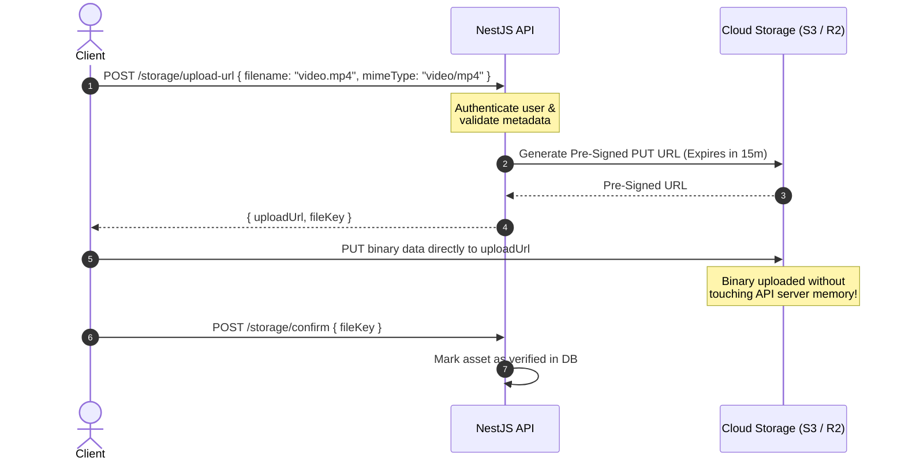

# 09 - File Storage & Multipart Uploads

> **Source Reference**: [NestJS Official Documentation - File Upload & Streaming](https://docs.nestjs.com/techniques/file-upload)

Handling file uploads and media delivery requires balancing server memory, event-loop responsiveness, and object storage security.

In modern production architectures, file storage follows two primary paradigms:
1. **Direct Multipart Ingestion**: Files uploaded directly to the NestJS API server via `multipart/form-data`, validated with `ParseFilePipe`, and stored locally or forwarded to storage.
2. **Pre-Signed Direct-to-Cloud Uploads**: The client requests a secure pre-signed PUT URL from the NestJS API and uploads the binary payload directly to S3 / Cloud Storage / Cloudflare R2, completely bypassing API server bandwidth and memory.

---

## 1. Multipart Uploads with `FileInterceptor`

NestJS integrates with [Multer](https://github.com/expressjs/multer) via platform interceptors.

### Installation

```bash
pnpm --filter @aaraj/api add -D @types/multer
```

### Single File Upload Endpoint

```typescript
// src/files/files.controller.ts
import {
  Controller,
  Post,
  UseInterceptors,
  UploadedFile,
  ParseFilePipe,
  MaxFileSizeValidator,
  FileTypeValidator,
} from '@nestjs/common';
import { FileInterceptor } from '@nestjs/platform-express';
import { FilesService } from './files.service.js';

@Controller('files')
export class FilesController {
  constructor(private readonly filesService: FilesService) {}

  @Post('upload')
  @UseInterceptors(FileInterceptor('file')) // 'file' matches the multipart form field name
  async uploadFile(
    @UploadedFile(
      new ParseFilePipe({
        validators: [
          // 1. Max size: 5 MB limit
          new MaxFileSizeValidator({ maxSize: 5 * 1024 * 1024 }),
          // 2. Strict MIME type check
          new FileTypeValidator({ fileType: 'image\/(jpeg|png|webp)' }),
        ],
      }),
    )
    file: Express.Multer.File,
  ) {
    return this.filesService.saveFile(file);
  }
}
```

---

## 2. Multi-File Upload Variations

NestJS provides specialized interceptors for different multipart payload structures:

### Multiple Files under the Same Field (`FilesInterceptor`)

```typescript
import { FilesInterceptor, UploadedFiles } from '@nestjs/platform-express';

@Post('gallery')
@UseInterceptors(FilesInterceptor('photos', 10)) // Max 10 files
async uploadGallery(
  @UploadedFiles() files: Array<Express.Multer.File>,
) {
  return this.filesService.saveMultiple(files);
}
```

### Multiple Distinct Fields (`FileFieldsInterceptor`)

```typescript
import { FileFieldsInterceptor, UploadedFiles } from '@nestjs/platform-express';

@Post('profile')
@UseInterceptors(
  FileFieldsInterceptor([
    { name: 'avatar', maxCount: 1 },
    { name: 'coverPhoto', maxCount: 1 },
  ]),
)
async uploadProfileAssets(
  @UploadedFiles()
  files: {
    avatar?: Express.Multer.File[];
    coverPhoto?: Express.Multer.File[];
  },
) {
  const avatar = files.avatar?.[0];
  const cover = files.coverPhoto?.[0];
  return this.filesService.updateProfileAssets(avatar, cover);
}
```

---

## 3. Streaming File Downloads (`StreamableFile`)

When returning files (PDFs, exports, audio clips) from the API, **never** read the entire file into a Node.js `Buffer` in memory. Use `StreamableFile` to stream bytes directly from disk or cloud storage to the client socket:

```typescript
// src/reports/reports.controller.ts
import { Controller, Get, Param, Res, StreamableFile } from '@nestjs/common';
import type { Response } from 'express';
import { createReadStream } from 'node:fs';
import { join } from 'node:path';

@Controller('reports')
export class ReportsController {
  @Get(':id/pdf')
  downloadReport(
    @Param('id') id: string,
    @Res({ passthrough: true }) res: Response,
  ): StreamableFile {
    const filePath = join(process.cwd(), 'storage', 'reports', `${id}.pdf`);
    const fileStream = createReadStream(filePath);

    // Set headers on the response object
    res.set({
      'Content-Type': 'application/pdf',
      'Content-Disposition': `attachment; filename="report-${id}.pdf"`,
    });

    return new StreamableFile(fileStream);
  }
}
```

> **Performance Note**: `StreamableFile` automatically handles backpressure and cleans up stream file descriptors when the client disconnects.

---

## 4. Pre-Signed Cloud Storage Pattern (S3 / GCS / R2)

For production applications processing large files (videos, high-res photos, large documents), streaming files through the NestJS API server consumes unnecessary memory and network bandwidth.

**Recommended Pattern**: The client asks NestJS for a pre-signed upload URL, then uploads directly to AWS S3, Cloudflare R2, or Google Cloud Storage.



### Implementing Pre-Signed URL Generation

```typescript
// src/storage/storage.service.ts
import { Injectable, Logger } from '@nestjs/common';
import { S3Client, PutObjectCommand, GetObjectCommand } from '@aws-sdk/client-s3';
import { getSignedUrl } from '@aws-sdk/s3-request-presigner';
import { randomUUID } from 'node:crypto';

@Injectable()
export class StorageService {
  private readonly logger = new Logger(StorageService.name);
  private readonly s3 = new S3Client({ region: 'us-east-1' });
  private readonly bucketName = process.env.S3_BUCKET_NAME ?? 'aaraj-media-assets';

  async generateUploadUrl(fileName: string, mimeType: string) {
    const extension = fileName.split('.').pop();
    const fileKey = `uploads/${randomUUID()}.${extension}`;

    const command = new PutObjectCommand({
      Bucket: this.bucketName,
      Key: fileKey,
      ContentType: mimeType,
    });

    // URL expires in 15 minutes (900 seconds)
    const uploadUrl = await getSignedUrl(this.s3, command, { expiresIn: 900 });

    this.logger.log(`Generated upload URL for key: ${fileKey}`);
    return { uploadUrl, fileKey };
  }
}
```

---

## 5. File Upload Security Checklist

| Vulnerability | Mitigation Strategy |
| :--- | :--- |
| **Denial of Service (OOM via Huge Files)** | Enforce `MaxFileSizeValidator` and web server (Nginx/Traefik) `client_max_body_size`. |
| **Path Traversal Attacks** | Never use client-supplied filenames on disk; generate server-side unique UUIDs (`randomUUID()`). |
| **Malicious Executable Execution** | Store uploads outside web root. Strictly validate MIME types and file signatures. |
| **Unauthorized Public Access** | Ensure storage buckets are **Private by default**; serve files only via pre-signed GET URLs or authenticated streaming. |
