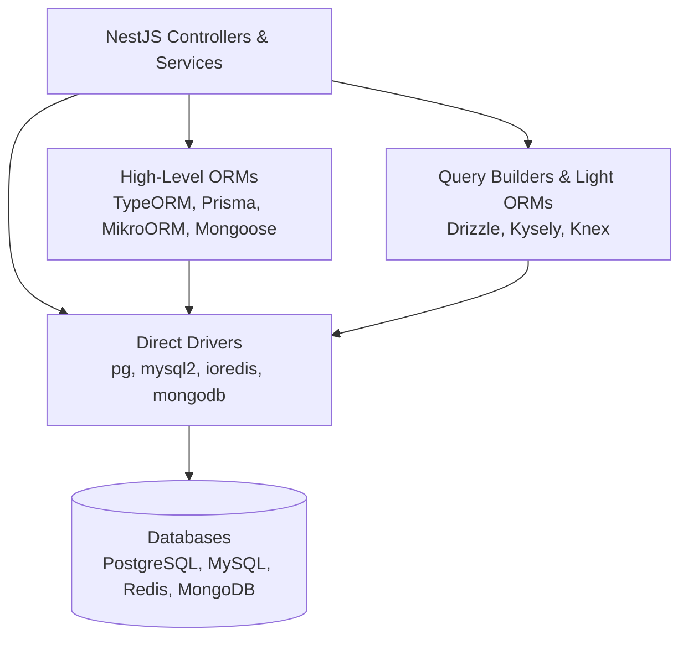

# 01 - Data & Persistence Overview

> **Source Reference**: [NestJS Official Documentation - Data Overview](https://docs.nestjs.com/data/overview)

NestJS is completely **database-agnostic**. The framework imposes no proprietary database driver or query dialect. At its most fundamental layer, connecting NestJS to a database is simply exposing a configured Node.js client or connection pool through a dependency injection **provider**.

Enterprise applications, however, typically operate at higher levels of abstraction using query builders, Data Mappers, or Object-Relational Mappers (ORMs) to guarantee type safety, simplify migrations, and enforce data integrity.

---

## 1. Persistence Abstraction Levels



### 1. Direct Drivers (`pg`, `mysql2`, `ioredis`)
- **Pros**: Zero runtime abstraction overhead; direct access to proprietary database features (e.g. Postgres `LISTEN/NOTIFY`, binary copy streams).
- **Cons**: Manual SQL string concatenation, no compile-time type safety, manual connection pool and transaction management.

### 2. Query Builders (`Drizzle`, `Kysely`, `Knex`)
- **Pros**: SQL-like syntax without string concatenation; compile-time schema type safety; lightweight footprint; predictable query generation.
- **Cons**: Requires writing explicit queries; minimal automatic relationship hydration compared to full ORMs.

### 3. Full Object-Relational Mappers (`TypeORM`, `Prisma`, `MikroORM`, `Sequelize`)
- **Pros**: Rich domain entity modeling, automatic relationship cascades and eager/lazy loading, built-in migration tooling, repository patterns.
- **Cons**: Potential performance overhead (N+1 query traps if unmonitored), complex abstraction layers, varying code generation steps.

---

## 2. Architectural Design Patterns

### The Repository Pattern
Decouples business logic from data access logic. Services depend on an abstract repository interface rather than raw queries:

```typescript
// Service interacts only with the repository abstraction:
@Injectable()
export class UsersService {
  constructor(
    @InjectRepository(User)
    private readonly userRepository: Repository<User>,
  ) {}

  findActiveUsers() {
    return this.userRepository.find({ where: { isActive: true } });
  }
}
```
* **Implementations**: TypeORM, MikroORM, `@nestjs/typeorm`.

### The Data Mapper & Unit of Work Pattern
Entities remain pure domain models with zero knowledge of the database. A separate `EntityManager` tracks changes across multiple entities and writes all mutations in a single atomic flush:
* **Implementations**: MikroORM.

### The Schema Inference Pattern (TypeScript-First)
Tables are declared using functional schemas. Row types (`User`, `NewUser`) are inferred directly via TypeScript compiler types without class decorators or generated code artifacts:
* **Implementations**: Drizzle ORM (`pgTable`, `$inferSelect`, `$inferInsert`).

---

## 3. Database Connection Lifecycles & Graceful Shutdown

Databases maintain open TCP socket pools. In production containerized deployments (Kubernetes, AWS ECS), terminating a container without closing database connections causes connection leaks, hung database transactions, and client timeouts.

### Connection Management Rules
1. **Singleton Pools**: Connection pools must be initialized as singletons during application bootstrap (`AppModule.forRoot()`).
2. **Graceful Teardown**: Enable NestJS shutdown hooks in `main.ts` so the database driver cleans up its pool when receiving `SIGTERM`:

```typescript
// apps/api/src/main.ts
async function bootstrap() {
  const app = await NestFactory.create(AppModule);
  
  // Mandatory for database connection cleanup:
  app.enableShutdownHooks();

  await app.listen(3000);
}
bootstrap();
```

---

## 4. Selecting the Right Persistence Engine for `@araz`

| Requirement | Recommended Solution | Rationale |
| :--- | :--- | :--- |
| **High-Throughput Microservices & Serverless** | **Drizzle ORM** | Instant cold starts, zero reflection metadata, direct SQL control, lightweight bundle. |
| **Traditional Enterprise SQL with Complex Graphs** | **TypeORM** or **MikroORM** | Mature repository pattern, rich decorator ecosystem, automated relationship cascade. |
| **Rapid Prototyping & Declarative Modeling** | **Prisma** | Single declarative `schema.prisma` file, auto-generated migrations, intuitive client API. |
| **Document / Semi-Structured Storage** | **Mongoose** (`@nestjs/mongoose`) | Deep MongoDB integration, document schemas, subdocument validation, index management. |
| **Low-Latency In-Memory Storage & Read Caching** | **Cache-Manager + Redis** (`@nestjs/cache-manager`) | Sub-millisecond reads, distributed session storage, automatic HTTP response caching. |
