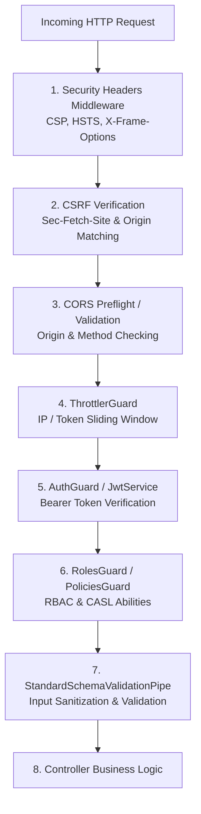

# NestJS Security & Threat Mitigation Reference

> **Source Reference**: [NestJS Official Documentation - Security](https://docs.nestjs.com/security/authentication)

Security in enterprise web services requires a defense-in-depth approach spanning transport security, client isolation, credential protection, identity verification, fine-grained access control, and denial-of-service mitigation.

This directory provides comprehensive architectural reference and production best practices for all official security integrations and threat countermeasures in NestJS.

---

## Security Tier Table of Contents

| Chapter | Topic | Key Focus Areas |
| :--- | :--- | :--- |
| **01** | [Authentication](file:///home/solo/JUNK/OFC/LK/aaraj/docs/backend/security/01-authentication.md) | `@nestjs/jwt`, `JwtService`, stateless Bearer tokens, `AuthGuard`, global authentication, `@Public()` metadata |
| **02** | [Authorization](file:///home/solo/JUNK/OFC/LK/aaraj/docs/backend/security/02-authorization.md) | RBAC (`@Roles()`, `RolesGuard`), Claims-based access, CASL (`@casl/ability`, `MongoAbility`), `PoliciesGuard` |
| **03** | [Encryption & Hashing](file:///home/solo/JUNK/OFC/LK/aaraj/docs/backend/security/03-encryption-hashing.md) | AES-256-CTR with `node:crypto`, salted password hashing with `bcrypt` / `argon2`, timing attack prevention |
| **04** | [Security Headers](file:///home/solo/JUNK/OFC/LK/aaraj/docs/backend/security/04-security-headers.md) | `app.useSecurityHeaders()` (NestJS 12.1+), CSP directives, HSTS, `X-Frame-Options`, Swagger/GraphQL accommodations |
| **05** | [CORS](file:///home/solo/JUNK/OFC/LK/aaraj/docs/backend/security/05-cors.md) | `enableCors()`, origin allowlisting, Express vs Fastify method disparity, preflight handling |
| **06** | [CSRF Protection](file:///home/solo/JUNK/OFC/LK/aaraj/docs/backend/security/06-csrf-protection.md) | Built-in Fetch Metadata protection (`Sec-Fetch-Site`), trusted origins, webhook exclusions, token fallbacks |
| **07** | [Rate Limiting](file:///home/solo/JUNK/OFC/LK/aaraj/docs/backend/security/07-rate-limiting.md) | `@nestjs/throttler`, multi-tier throttlers, `@Throttle()`, proxy IP tracking (`X-Forwarded-For`), Redis storage |

---

## Defense-in-Depth Pipeline Architecture

Incoming HTTP requests traverse security layers in a deterministic, fail-closed sequence:

---

## Core Security Commitments for `@aaraj`

1. **Zero Plaintext Credentials**: Passwords, refresh tokens, and authentication secrets must **never** be stored in plaintext. Passwords must be hashed using salted one-way algorithms (`bcrypt` with >= 10 salt rounds or `argon2`).
2. **Fail-Closed Authentication**: Routes are authenticated by default using global `APP_GUARD`. Public routes must explicitly declare the `@Public()` decorator.
3. **Strict Origin Validation**: CORS and CSRF must never use wildcard `*` origins in production when credentials (cookies, authorization headers) are transmitted.
4. **Automated Header Hardening**: All API instances must invoke `app.useSecurityHeaders()` to enforce HSTS, no-sniff, and restrictive frame options.
